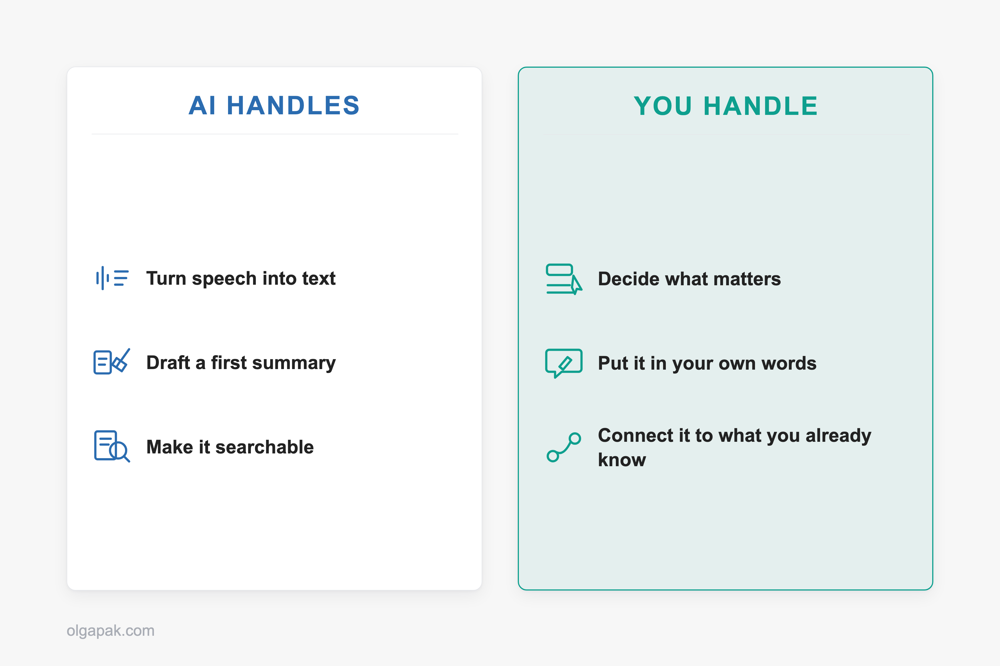
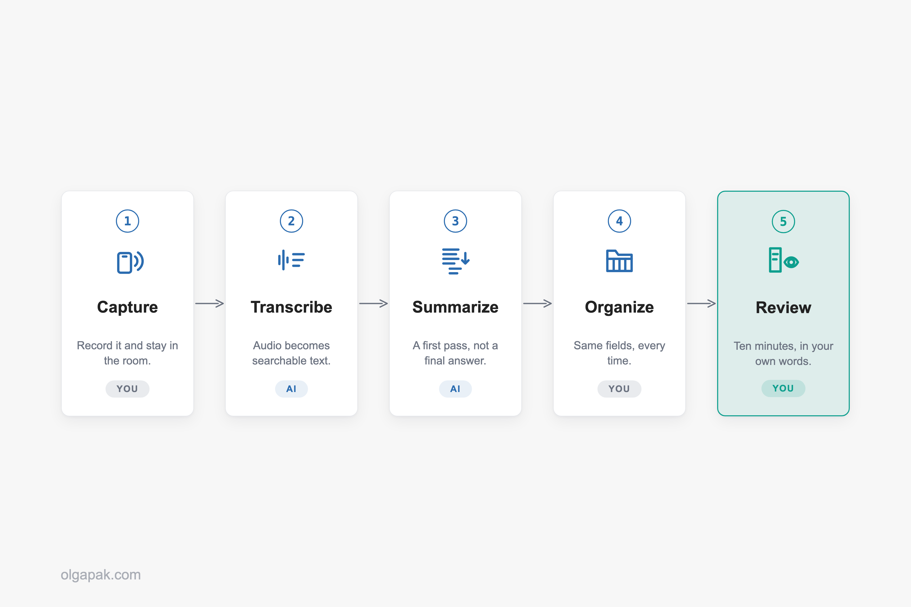

The pitch for AI note-taking is that you never have to take notes again. That is exactly the part I ignore.

I build my own AI productivity tools on OpenAI. I've spent enough time watching them do the boring half of my work brilliantly, and the thinking half badly, to know roughly where the line sits.

I have already dug into [whether digital or paper notes actually work better](/digital-vs-paper-notes) on this blog, and AI is the third option that whole argument never planned for: it doesn't just change what you write with, it offers to write instead of you.

This guide covers what AI note-taking actually does, the five-step workflow I run, which kind of tool fits which job, and the three things that catch people out.

## What AI note-taking actually does (and what it doesn't)

The label bundles three different jobs together, and the tools are much better at two of them than at the third.

- **Transcription** turns speech into text. This is the job AI genuinely solved.
- **Summarization** takes a long piece of text and hands you a shorter one.
- **Note-taking** is deciding what mattered. That is a judgment call about your exam, your project, your next conversation.

Most products sold as AI note-takers do the first two beautifully. Then they quietly hand the third back to you, usually in the shape of a very tidy document you never open again.

Microsoft's own guide to the category describes the process as five steps: capture, transcribe, structure, summarize, sync. The useful part of that framing is that every step has its own way of failing. A tool that never gets past step four leaves the filing to you, and a folder of unfiled transcripts is a pile, not a system.

So why does an AI summary sometimes contain a sentence nobody said?

The answer is one piece of jargon worth translating. Summarizers work in two ways. Extractive summarizing picks out the sentences that already carry the most meaning and shows you those. Abstractive summarizing writes new sentences that say the same thing in fewer words.

That second kind is the culprit. It isn't a quote. It is the model's paraphrase, and a paraphrase can shift the meaning of a point while sounding completely certain about it.

## Why you still take the notes, and AI does the rest

So if the software can capture, transcribe and summarize, what is actually left for you to do?

Quite a lot, and the evidence here is more interesting than the version that usually gets quoted at you. In the original lecture-note study, [laptop note-takers recorded more of the lecture word for word and did worse on conceptual questions](https://journals.sagepub.com/doi/full/10.1177/0956797614524581) than the students writing longhand. That result traveled fast and got flattened into "write it by hand".

Then researchers re-ran it in 2019 and found that [performance did not consistently differ between any of the groups](https://link.springer.com/article/10.1007/s10648-019-09468-2), including a group that took no notes at all, and a meta-analysis of the direct replications found the small effects favoring longhand were not statistically significant.

Which tells you the pen was never the active ingredient. What the first study caught was a behavior: the longhand group physically could not keep up, so they had to choose what to write down and rephrase it as they went. That choosing and rephrasing is where the understanding happens, and it is precisely the part a finished AI summary removes.

Here is what you are actually doing when you take a note yourself:

- Deciding this sentence matters and that one doesn't
- Putting the idea in your own words, which forces you to check that you understood it
- Hooking it onto something you already know

Someone on r/askanything said it more bluntly than I would: "A lot of learning happens during the note taking process. If you farm out that process, you're missing out." Another commenter in the same thread described the compromise I have landed on myself, which is to record the lecture and then take the notes afterwards, when you can pause and rewind instead of scrambling to keep up.

This is also why [the Cornell note-taking method](/cornell-note-taking-method) keeps outliving newer systems. Cornell's own study center describes it as [a cue-and-recite loop](https://lsc.cornell.edu/notes.html): you cover the page and pull the answers back out of your own head. AI output should feed that loop, not replace it.

## My 5-step AI note-taking workflow

Five steps, and only two of them belong to the machine: capture, transcribe, summarize, organize, review. I run the same shape for lectures, client calls and long research reads, and it barely changes between them.

The order matters more than the tools do. Skip step five and you have built an archive rather than a note-taking system, and archives are where information goes to be politely ignored.

### Step 1, Capture: record it, and stay in the room

There is one decision here: what does the recording. Your phone face-up on the desk, the note-taker built into your video-call app, a tablet, or a dedicated recorder. The only real requirement is that it needs zero attention once it starts, because the moment you are managing the recording, you have stopped listening.

If your capture device is a tablet, the setup I use for [taking notes on an iPad](/how-to-take-notes-on-ipad) drops straight into this workflow.

Two cautions. Recording is not always allowed, which is what the last section of this post is for. And recording is not permission to check out: on the r/LifeProTips thread about this workflow, the single most-upvoted reply argued that in plenty of jobs the real work happens *during* the meeting, and if you don't engage in the conversation you pay for it afterwards.

### Step 2, Transcribe: turn the recording into searchable text

The point of a transcript is not that you will read it. You won't. The point is that an hour of audio becomes text you can search, so you can find the ninety seconds that mattered without dragging a slider back and forth for ten minutes.

One student who tested more than thirty of these tools described running a statistics lecture through one and getting it back split into chapters by topic, with timestamps sitting on the worked examples. That is the actual win. Not a document to read, a map to the recording.

### Step 3, Summarize: get a first pass, not a final answer

Ask for a summary, then treat it as the first draft of your understanding rather than the finished article. The same student, after three months of testing, landed on exactly this: AI summaries of long lectures are hit-or-miss, and the summary is a starting point, not a replacement for sitting with the material.

Vague prompts get vague summaries, so I ask for a specific shape:

- The main argument or the decision, in one line
- The evidence or reasoning behind it
- Anything the speaker flagged as important

When the source is already text rather than audio (a long reading, an email chain that got out of hand), this step doesn't need a note-taking app at all. It's the job my free [Text Summarizer](https://olgapak.com/ai-tools) does: paste the text, get back something short enough to actually scan.

### Step 4, Organize: give the output a shape you'll recognize later

An AI summary that lands in a folder alongside every other AI summary is not a note. It is a search result you haven't found yet.

Pick one structure and push every summary through it. Mine is deliberately boring: date and source, what it was about in one line, the things worth remembering, anything I owe someone. Same fields every time, so I know where to look six weeks later.

If you have never consciously picked a structure, the [note-taking methods](/note-taking-methods) guide is the menu to choose from. Outlining, charting, mapping, Cornell. Any of them beats no shape at all.

### Step 5, Review: the ten minutes that make it stick

This is the step people skip, and it is the only one that makes the other four worth doing.

Straight after the session, while it is still warm, spend ten minutes writing down three things in your own words:

- The one decision that was actually made
- Who is doing what, by when
- The follow-up message you owe someone

From the summary, not copied out of it. That rewriting is the deciding-and-rephrasing the section above was about. You have simply moved it from during the lecture to just after it.

One person on r/LifeProTips reported their post-meeting admin dropping from 45 minutes to 10 after switching to record-then-summarize. That is one person's experience rather than a general figure, but the direction matches mine. Ten minutes is short enough to survive a busy week, especially if you [plan your week](/how-to-plan-your-week) with the review slots already sitting in it.

## Which AI note-taking tool fits which job

I am not going to rank these, because the ranking depends entirely on what you are recording. Match the job first and the shortlist gets very short, very fast.

| The job | The kind of tool that fits | Where it falls down |
|---|---|---|
| Video calls you're on | The AI note-taker built into your meeting app, or a bot that joins the call | Captures nothing in a physical room, and is often ruled out by workplace policy |
| Lectures and long recordings | A recorder plus transcription that chapters the audio by topic | Summaries of long sessions are uneven, so you still do the review step |
| Questions about your own documents | Source-grounded question answering over files you upload | Not a live recorder; it works on what you give it |
| Notes you already keep | The AI features bolted onto the notes app you already use | Tidies what's written, doesn't capture what's said |
| Corridors, walks, in-person chats | A dedicated hardware recorder you wear or carry | Consent gets awkward, and everything needs reviewing before you trust it |

So how do you choose inside a row?

Five things are worth checking before you commit, whichever row you are in:

- **Does it hear the room, or only the call?** That question alone rules out a lot of tools before you try them.
- **Does it chapter or timestamp long audio?** Otherwise you are back to dragging a slider around.
- **Can you export the transcript?** If the text is stuck in the app, so is everything you build on it.
- **Does it show the source passage behind a summary line?** Without it, you are trusting a paraphrase you cannot check.
- **Where does the audio actually go?** Answer that before you record anyone, and see the permission-and-privacy section below.

The lecture row deserves the closest look, because that is where most people reading this actually live. A good tool turns a 75-minute recording into something you can navigate: chaptered by topic, timestamps sitting on the worked examples, the way step two described. A bad one hands you one undifferentiated block and a tidy summary you cannot revise from.

The one tool I'll name is Gemini Notebook, which Google used to call NotebookLM. There's a free tier with usage limits and a paid upgrade above it, and what it does is unusually easy to describe: Google says it is [designed to answer questions based on the information provided in your uploaded sources](https://support.google.com/gemininotebook/answer/16164461), with in-line citations back to the passage each answer came from. That second half matters more than it sounds. Being able to click through to the sentence an answer came from is how you catch a summary that has drifted away from the source. It is not a live meeting recorder, though, so it solves your reading pile, not your lecture.

Hardware recorders are the category people ask about most and trust least. Someone on r/AI_Agents, four months into using a wearable one, put it about as fairly as it can be put: "I still review it before using the notes, but it's a lot better than trying to remember a long call from scratch at the end of the day." Review before you use it. That is the honest baseline for all five rows of that table, not just the last one.

## Where AI note-taking still falls down

Three things break, reliably. Knowing which one you're hitting saves a lot of pointless tool-shopping.

**The transcript.** Accuracy is not uniform. It drops with strong accents, with people talking over each other, and with field-specific jargon, which is inconvenient when your lectures are full of both. How unevenly? One 2020 study fed the same kind of recorded interview to five commercial speech recognition systems, the ones built by Amazon, Apple, Google, IBM and Microsoft, and found [an average word error rate of 0.35 for black speakers compared with 0.19 for white speakers](https://www.pnas.org/doi/10.1073/pnas.1915768117). Roughly twice the errors, from the same five systems, on the same task. That study looked at one specific gap rather than at accents generally, so treat it as evidence that whose voice it is changes the result, not as a number for your own lecture hall. Before you commit to anything, trial it on a real recording of your own, made in the room you actually sit in, rather than on the vendor's clean demo audio.

**The summary.** It can emphasize the wrong thing, skip the section that turned out to matter most, and, thanks to that abstractive rewriting from earlier, produce a fluent sentence nobody said. A summary that is mostly right is more dangerous than one that is obviously wrong, because you stop checking it.

**The never-re-read trap.** This is the one that got me. A folder of summaries you never open is worse than three scrappy lines you wrote yourself, because it *feels* like preparation. Ouch.

Here's what I check on a trial run before a tool earns a place in the workflow:

- Does the transcript survive one genuinely messy recording of mine?
- Can I find a specific moment in it in under a minute?
- After a week, have I actually re-opened anything it produced?

And then there is the noise. @wojakcodes on X dismissed a launch as "probably another one of those vibe coded AI note-taking apps. I've seen at least a dozen of these on my tl today and they're all the same." That's harsh, and not entirely wrong: most of these tools do the same two jobs. Which is why picking by job beats picking by launch-day hype.

## Before you hit record: permission, policy and privacy

Four checks. They take about a minute each, and you do them once per context, not once per recording.

- **Ask the people in the room.** Out loud, before you start. It is a much smaller conversation than the one you have when someone finds out later.
- **Check the rules where you are.** Recording rules differ by country, and inside the US the Federal Trade Commission says plainly that [state laws vary on permitting the recording of telephone conversations and the requirements to obtain consent of the recorded party](https://www.ftc.gov/business-guidance/resources/complying-telemarketing-sales-rule). Some settings need everyone involved to agree. This is not something to guess at, and it isn't something I can answer for you.
- **Check your employer's or your campus's policy.** As one commenter on r/LifeProTips put it: "Many companies specifically prohibit recording meetings or using transcribing AI tools. And they often disable the tools."
- **Read the actual privacy policy, not the landing page.** They are different documents and they often say different things.

That last one sounds like a platitude until you see it play out. In a thread of therapists reading the terms of the tools marketed to them, one platform's site said data is never used to train AI, while its privacy policy allowed the company to create de-identified data derived from anything processed through the service.

It also helps to know where the audio commonly goes. The app you tap is often only the front end: the recording frequently travels to a separate transcription company, and the transcript on to a general AI provider, so one conversation can pass through three or four businesses before it comes back to you as a neat summary. Your seminar notes are not a therapy session and the stakes are nowhere near the same. The reading habit is.

## Start with the mundane half

The workflow is the point, not the shopping list. The mundane half of it, capturing, transcribing, and squeezing a wall of text into something you can scan, is exactly the kind of work a small tool should be quietly doing while your attention goes somewhere it counts.

[Try my free AI tools](https://olgapak.com/ai-tools) to automate the mundane. No signup, nothing to cancel, and each one does a single job. The thinking half stays yours, which is the way round it should be.

## FAQ

### Is it cheating to use AI to take notes in college?

Recording and transcribing a lecture is not cheating, but policies genuinely differ and some institutions ban recording outright, so check your course handbook or ask the lecturer first. The line most people draw is between AI carrying the notes and AI doing the understanding.

### Does using AI to take notes hurt your memory?

The tool is not the risk, the shortcut is. When researchers re-ran the famous longhand-versus-laptop study, performance did not consistently differ between the groups and the effects favoring longhand were small and not statistically significant. What holds up is that the processing does the work, so outsourcing the deciding and rephrasing is what costs you.

### What is the best free AI note-taking tool?

For material you already have, Gemini Notebook, formerly NotebookLM, is the strongest free-tier option I know, because it answers from the sources you upload and cites the passage each answer came from. It is not a live meeting recorder, though. Rather than hunting for one winner, match the tool to the job.

### Do I need to tell people I'm recording a meeting?

Ask, always, then check the rules where you are, because they differ by country and by US state and some settings require everyone involved to agree. Many employers also prohibit recording meetings or transcription tools regardless of the law. This is general information, not legal advice.
