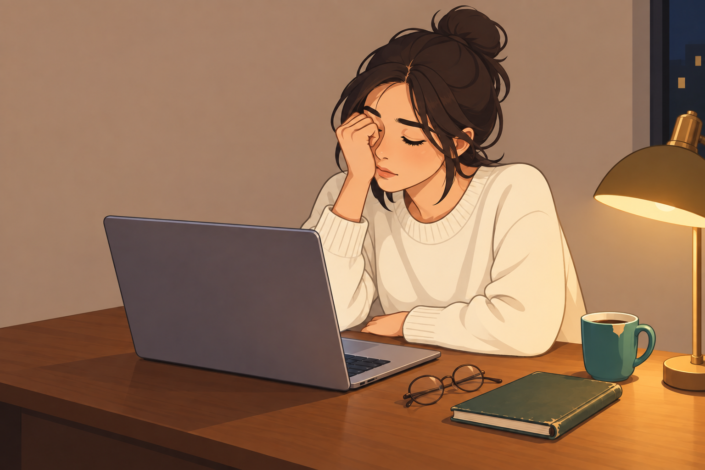
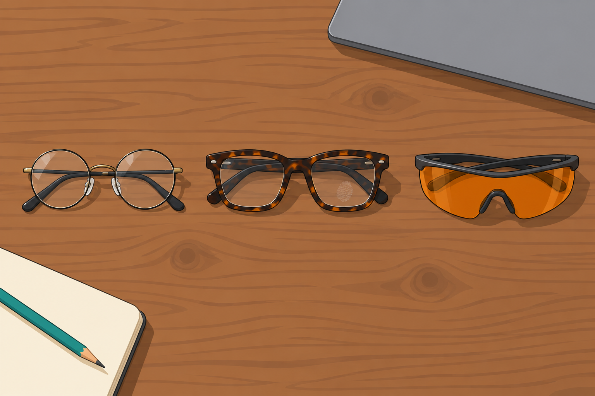
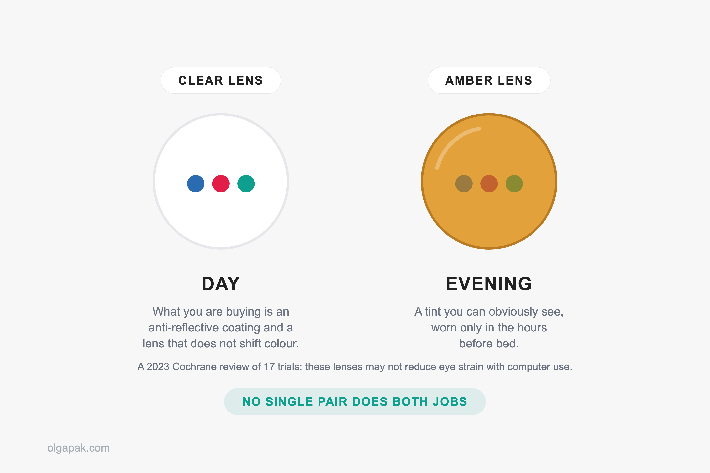
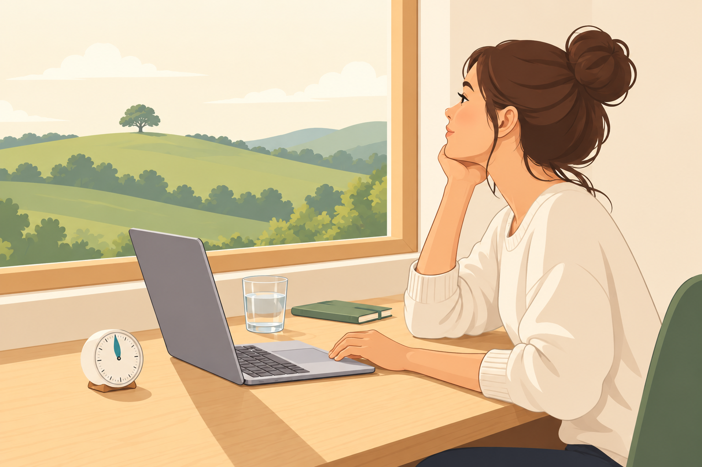

By 9pm my eyes felt like sandpaper, so I did what half the internet does and went looking for the best blue light glasses. Then I read the research, and the research does not say what the packaging says.

Between a Master's worth of late-night reading and building my own AI tools, I have spent more evenings in front of a screen than I would like to admit. So I went through the actual studies before spending anything.

If the real problem is hours rather than lenses, the honest fix is to [cut down the hours you spend on screens](/how-to-reduce-screen-time). And if you are [taking notes on an iPad](/how-to-take-notes-on-ipad) through every lecture, you are exactly who I wrote this for.

This guide covers what the research actually says, the 9 pairs I would pick and what each one gets wrong, whether you need a separate evening pair, and the habits that beat any lens.

*Some links in this guide are affiliate links. As an Amazon Associate, I earn from qualifying purchases, at no extra cost to you.*

## What the best blue light glasses can and can't do

Three separate promises get printed on the same box: less eye strain, protection from eye damage, and better sleep. They do not carry anything like the same weight of evidence behind them, so it is worth pulling them apart before you spend a penny.

| Claim marketed | What the evidence says | What to do instead |
|---|---|---|
| They stop screen eye strain | A 2023 Cochrane review of 17 randomised trials concluded the lenses "may not attenuate symptoms of eye strain with computer use" over short-term follow-up | Take breaks, blink deliberately, try artificial tears |
| Screen blue light damages your eyes | The American Academy of Ophthalmology says there is no scientific evidence that light from computer screens damages the eyes | Nothing, on the evidence we have |
| They fix your sleep | Graded very-low-certainty and split: of six Cochrane trials reporting sleep scores, three found a significant improvement and three found none | Fewer screens before bed, night mode, a consistent wind-down |

Start with eye strain, because that is what most people are actually buying. The strongest independent look at the question is a 2023 Cochrane systematic review of 17 randomised controlled trials, whose authors concluded that [blue-light filtering spectacle lenses may not attenuate symptoms of eye strain with computer use](https://pubmed.ncbi.nlm.nih.gov/37593770/) over a short-term follow-up period, compared with ordinary lenses.

Note the wording. Not "they do nothing", and the reviewers graded the finding low-certainty off trials running from under a day to five weeks.

Damage is the easier one. The American Academy of Ophthalmology states there is no scientific evidence that the light coming from computer screens is damaging to the eyes, and because of that, [the Academy does not recommend any special eye wear for computer use](https://www.aao.org/eye-health/tips-prevention/are-computer-glasses-worth-it).

The same page names the mechanism behind gritty evening eyes: long hours on a screen make you blink less, and blinking less dries the surface of the eye. And if blue light itself worries you, the Academy is blunt about where most of it comes from: [the largest source of blue light is sunlight](https://www.aao.org/eye-health/tips-prevention/should-you-be-worried-about-blue-light), not your laptop.

Sleep is the one place the door is genuinely still open. Of the six trials in that review reporting sleep scores, three found a significant improvement and three found no significant difference, and the reviewers graded the whole sleep question very-low-certainty. Indeterminate is not the same as disproven.

So does that make you an idiot for owning a pair? Absolutely not.

If any of these are true, you bought something real:

- You like how a lens feels.
- It cuts the reflection of your own room off a bright screen.
- Putting it on at 9pm is the cue that starts your wind-down.

It just is not medicine. And yes, some links below earn me a commission, which is exactly why I would rather say it here: the free habits further down this page have better evidence behind them than anything on the shopping list.

## How I picked these blue light glasses

I have not put a single one of these through a lab, and I am not going to pretend otherwise. Every pick below traces to a named independent review, one of the roundups I read for this post, or fills a category students genuinely need filled, like a cheap first pair or a prescription option.

The one thing I refused to rank on is the number on the box.

One hobbyist tester ran more than 30 pairs past a spectrometer and came back with two findings worth knowing. Wraparound frames let in far less unfiltered light than flat frames do, because light simply arrives around the edges of a flat lens. And a single "% blocked" figure hides which metric is being measured, so two pairs claiming the same number can behave completely differently.

That is one careful person with one instrument, not a clinical result. It is still more measurement than any brand page offers you.

Here is what I actually weighed:

- **Fit and weight**, because a pair you notice at hour three is a pair you stop wearing.
- **A good anti-reflective coating**, the treatment that stops your own room reflecting back off the lens. This is the part of the purchase with the most obvious day-to-day payoff.
- **How little the lens shifts colour.** Some are near-colourless. Some make white paper look like weak tea.
- **Prescription availability**, since wearing two pairs stacked is nobody's plan.
- **Price band**, budget, mid or premium, never a dollar figure, because eyewear pricing moves constantly.
- **For evening pairs only, a tint you can actually see.** A lens that looks clear is not doing the amber job.

Where a pick is here on brand reputation rather than an independent test, I say so in the entry.

## The 9 best blue light glasses for students

If you want one answer and no shopping, take the SOJOS SJ5511. It looks like ordinary glasses, it barely tints the world, and SOJOS was the brand behind the top style pick in one of the independent roundups I read.

Every entry below follows the same shape: what it is best for, why it earns the spot, and the honest catch. I didn't rank any of it on how much blue light it claims to block.

So which one do you actually buy?

| Pick | Best for | The catch |
|---|---|---|
| SOJOS SJ5511 | Most people, most of the time | Thin wire arms bend easily in a bag |
| Tijn Blue Light Blocking Glasses | Trying the idea cheaply | Build quality is what you pay for |
| Felix Gray Jemison | All-day work and video calls | Premium money for an unproven core claim |
| Warby Parker blue-light lenses | One pair that works as everyday glasses | You are buying frames first, coating second |
| EyeBuyDirect | Prescription on a budget | You need your measurements before ordering |
| Zenni Blokz | Prescription value without the counter upsell | Nobody adjusts the fit for you |
| Peepers by PeeperSpecs | Anyone who also needs readers | Wrong pick if you don't need magnification |
| GUNNAR | People who like a warm-looking screen | Noticeable colour shift, and no independent test |
| Swanwick Swannies | A dedicated evening pair | You cannot judge colour through them |

### SOJOS SJ5511, best overall

[SOJOS SJ5511 blue light glasses on Amazon](https://www.amazon.com/dp/B0H7B5N2DV?tag=op01e-20)

**Best for:** anyone who wants a pair that looks normal and does not tint the world.

The wire frame is light, the lens is close to colourless, and that second point is the one that decides whether a pair stays on your face. Colour distortion is the complaint people actually quit over, and this pair barely has any. The pair that roundup actually named, the She Young, has since disappeared from Amazon, which happens constantly at this price band. This is SOJOS's current blue-light model, and the reason the brand earned the spot, a light wire frame with a near-colourless lens, is unchanged.

**The catch:** thin wire arms are easy to bend if you throw them in a bag with a laptop and a water bottle. Use the case.

**Skip if:** you are hard on your things.

### Tijn Blue Light Blocking Glasses, best cheap first pair

[TIJN blue light blocking glasses on Amazon](https://www.amazon.com/dp/B0GYNQZMB6?tag=op01e-20)

**Best for:** finding out whether you like wearing a pair at all before committing money.

This is the budget-band answer, and it was the budget pick in one of the roundups I read. The frames are light enough to forget about, and they come in a wide enough range of colours that you can pick one you will not be embarrassed by in a seminar. For a first pair, that is the whole job.

**The catch:** build quality is exactly what you paid for. Hinges loosen, arms flex.

**Skip if:** you want the pair you own in three years.

### Felix Gray Jemison, best for all-day work and video calls

[Felix Gray Jemison](https://felixgray.com/products/jemison-plano)

**Best for:** back-to-back calls where the screen glare is visible on your own face.

Premium band, and the anti-reflective coating is where the money goes. This was a recurring "best for working" pick in two separate independent roundups, both calling out low glare on video calls, and there is a prescription option. It is comfortable enough that I would believe someone wearing it from 9am to 6pm.

**The catch:** this is premium money for a product whose headline claim is unproven, and that is a genuinely fair thing to hesitate over.

**Skip if:** the coating is not the part you are buying.

### Warby Parker blue-light lenses, most versatile

[Warby Parker's blue-light lens frames](https://www.warbyparker.com/eyeglasses/blue-light)

**Best for:** readers who want one pair that works as their everyday glasses, not a desk accessory.

The Thurston frame kept showing up as the "most versatile" pick in the roundups I read, and Warby Parker sells the blue-light filter as a lens option on almost any frame, which is the more useful way to buy it. It is prescription-compatible, and the frames are style-forward enough to wear outside. The home try-on culture around the brand also means you can find out whether a shape suits your face before you commit, which matters more than any lens spec.

**The catch:** you are buying the frames first and the coating second. Which, honestly, is the right way round.

**Skip if:** you already have frames you love.

### EyeBuyDirect, best prescription pick on a budget

[EyeBuyDirect's digital protection lenses](https://www.eyebuydirect.com/prescription-lens/digital-protection)

**Best for:** anyone who already wears glasses and does not want to pay optician prices for an add-on.

Prescription lenses at a budget band, from a retailer whose prescription-compatible picks made one of the independent roundups. The filter is a lens option rather than a fixed frame, so you choose the shape: that roundup named the Escape, and the Botanist as its sibling for smaller faces.

**The catch:** you need your prescription and your pupillary distance in hand before you order, and your optician will not always volunteer the second one.

**Skip if:** you do not have a current prescription.

### Zenni Blokz, best prescription value

[Zenni Blokz blue light lenses](https://www.zennioptical.com/blokz-blue-light-glasses)

**Best for:** prescription wearers who want the filter without the upsell at the counter.

Blokz is Zenni's own prescription blue-light lens line, and the filter is built into the lens rather than sold to you as a premium extra at the end of an eye test. One editor in the roundups I read named it their long-term daily-wear pair, which is a better signal than a week of testing.

**The catch:** ordering online means nobody sits opposite you and bends the arms until the fit is right.

**Skip if:** you need someone to adjust the frames in person.

### Peepers by PeeperSpecs, best if you also need readers

[Peepers by PeeperSpecs Kent reading glasses on Amazon](https://www.amazon.com/dp/B0CJSMX8XB?tag=op01e-20)

**Best for:** readers who need magnification and a filter in the same pair.

Mid band, light frames, and reading strengths available across the range, which is the whole reason this brand keeps appearing in roundups aimed at readers who already use reading glasses. If you are already reaching for readers to get through a dense PDF, buying two functions in one pair is simply less faff.

**The catch:** magnification you do not need will make a laptop screen worse, not better.

**Skip if:** your close-up vision is fine.

### GUNNAR, best for long sessions if you like a warm tint

[GUNNAR Intercept with the amber lens on Amazon](https://www.amazon.com/dp/B00CAUTK0E?tag=op01e-20)

**Best for:** people who genuinely prefer a warmer-looking screen for hours at a stretch.

GUNNAR built the computer-eyewear category and designed the frames for sitting still in one for a long time. Some people love the amber view. That is a real preference and a real reason to buy, in the same way some people prefer a warm desk lamp to a cold one.

**The catch, stated plainly:** the amber tint shifts colour noticeably, so it is useless for design work or anything where white needs to look white. Liking it is a preference, not proof it reduces eye strain. This brand also appeared in my research only through its own product page, not through an independent review.

**Skip if:** you edit photos, video or slides.

### Swanwick Swannies, best dedicated evening pair

[Swanwick Swannies sleep glasses on Amazon](https://www.amazon.com/dp/B01N0Q7RBM?tag=op01e-20)

**Best for:** night study and late reading, worn only in the hours before bed.

This is a genuinely dark amber lens rather than a clear one pretending, and the evening is the only time of day a tint this strong is worth wearing. If you are going to try the sleep side of this at all, try it with a lens you can obviously see the colour of.

**The catch:** you cannot judge colour through them, the brand's blocking percentages are marketing numbers nobody independent has verified, and cheaper amber pairs do the same job.

**Skip if:** you want one pair for both day and evening. That pair does not exist.

## Clear or amber: which pair do you actually need?

These are two different purchases answering two different questions, and blending them is how people end up disappointed.

Clear lenses are the daytime purchase, and what you are buying is a good anti-reflective coating and a lens that does not lie to you about colour. Amber is the evening purchase, and it rests on a different mechanism entirely: in lab conditions, [blue-wavelength light suppresses melatonin about twice as much as green light of the same intensity](https://pubmed.ncbi.nlm.nih.gov/12970330/). Whether a pair of glasses does enough about that to change your night is the part still being argued.

What do actual wearers say? Both things, loudly.

On r/Biohackers, u/ptarmiganchick described amber goggles as "life-changing. Like someone put a towel over my cage." In the very same thread, the person who ran the experiment wore a pair every evening for a week, logged sleep, mood, energy and morning and evening cortisol, and reported "Absolutely nothing. Total scam."

Commenters then pushed back on the one-week design too. That is the honest state of it: some people feel a lot, some feel nothing, and neither week of one person's life settles it.

The AAO's own evening advice is not optical at all. Avoid screens two to three hours before bed, and use your device's dark or night mode in the evening.

If that sounds harder than buying a lens, that is because it is, which is also why it works better. If your evenings vanish into your phone, [stop doomscrolling before bed](/how-to-stop-doomscrolling) will do more than an amber lens will, and having [screen-free hobbies for the evening](/screen-free-hobbies) ready is what makes it stick.

## What actually helps tired eyes, and it isn't lenses

The AAO already named the mechanism behind gritty evening eyes: a dry cornea, not the colour of the light. That is why the interventions that work are free and slightly boring.

Here is what the AAO actually recommends, plus what it looks like in practice:

- **The 20-20-20 rule.** Every 20 minutes, look at an object about 20 feet away for 20 seconds. That is it. It gives the focusing muscles a break and reminds you to blink.
- **Sit about 25 inches from the screen**, roughly an arm's length, rather than the half-arm's-length most of us drift to by hour four.
- **Blink on purpose, and try artificial tears.** Staring at a screen cuts your blink rate, and the eye drops treat the actual problem.
- **Use night mode in the evening** and turn the brightness down to match the room you are in.

Under an X thread with 265 replies asking whether blue light glasses helped, @lesrevenants967 cut through everything: "What helped me more than these glasses were eye drops (artificial tears)." Unglamorous, cheap, and aimed at the right mechanism.

Do I do all this perfectly? No. I set the 20-20-20 alarm on my phone and I ignore it roughly four times out of five, usually mid-sentence, usually while telling myself I will look up after this paragraph.

The version that survived for me was cruder: get up when the kettle needs filling, look out of the window while it boils, come back. If the hours themselves are the problem rather than the lighting, [a structured screen-time reset](/digital-detox-plan) is a better use of a week than any purchase on this page.

## How to buy a pair without getting upsold

There is a reason opticians offer you blue-light coatings three times during one eye test, and it is not clinical.

One optical-industry commenter on r/glasses put it bluntly: "I've seen marketing materials from lens manufacturers to retailers touting blue light coatings as a way to increase per transaction amounts." Another, u/post_melhone, described their own shop doing the opposite: "At my location we push the opposite of blue blocker and just recommend standard anti reflective coatings since we feel like blocking blue light only services you before bed versus all-day."

That second point is the practical one. A plain anti-reflective coating is the upgrade with the visible payoff, and it does not change how colour looks.

The colour complaint is the most common regret in that thread, summed up by one wearer as "Whites don't look white anymore, everything feels slightly off, like the world has a permanent filter on it." You cannot un-buy a coating that is bonded to your prescription lenses.

So what do you actually say at the counter?

- Ask what the blue-light add-on costs as a separate line item, out loud, before you agree to anything.
- Ask for plain anti-reflective instead and see how the answer changes.
- Buy a cheap non-prescription pair first, and find out whether you even like wearing one.
- If you wear a prescription, price the same lens online before you say yes in the shop.
- Read [the American Optometric Association's position on blue-light hype](https://www.aoa.org/news/clinical-eye-care/health-and-wellness/blue-light-hype-or-much-ado-about-nothing) before you are standing at a till being asked to decide.

None of that makes you a difficult customer. It makes you a customer who knows which part of the purchase has evidence behind it.

## The hours are the real problem, not the lens

No pair of glasses buys back an hour. What actually stopped my eyes feeling like sandpaper by 9pm was fewer hours in front of the screen, plus getting up more often, and the lens I own is a small comfort sitting on top of that.

[Try my free AI tools](/ai-tools) to automate the mundane part of a long screen day. Paste in the reading you have been squinting at and the Text Summarizer hands back a short, scannable version, which is one less hour of staring at something you were dreading. That is a bigger win than any coating.

## FAQ

### Do blue light glasses actually work?

It depends which claim you mean: for daytime eye strain, a 2023 Cochrane review of 17 randomised trials concluded the lenses may not attenuate symptoms of eye strain with computer use, and the American Academy of Ophthalmology does not recommend special eyewear for computer use. For evening sleep the evidence is indeterminate rather than settled: of six trials reporting sleep scores, three found a significant improvement and three found none, all graded very-low-certainty. Cochrane found adverse effects were infrequent, so for most people this is a comfort decision rather than a medical one.

### Are blue light glasses worth it for students?

They are worth it if comfort, glare or an evening wind-down cue is what you are actually buying. A light frame with a good anti-reflective coating makes a bright screen easier to sit in front of. They are not worth it if you expect them to fix eye strain, because that comes from blinking less while you stare, and breaks and eye drops address it directly.

### Should I get clear or amber lenses?

Treat them as two separate purchases. Clear lenses are for daytime wear, where colour accuracy matters and you want a good anti-reflective coating without your whites turning yellow. Amber lenses are for the hours before bed only, and they should be dark enough that you can obviously see the tint.

### Can blue light from screens damage my eyes?

The American Academy of Ophthalmology's position is that there is no scientific evidence that the light coming from computer screens is damaging to the eyes, and because of that it does not recommend any special eyewear for computer use. Tired, gritty eyes at the end of a long day are a comfort problem caused by reduced blinking, not damage. If your vision itself is changing, that is a reason to book an eye test, not to buy a filter.

### Do I need a prescription pair or will cheap ones do?

If you already wear glasses, get the filter on your prescription lenses rather than stacking two pairs, and price it online before agreeing to it at the counter. If you do not wear glasses, start with a cheap non-prescription pair. It costs very little to find out whether you actually like wearing one.
