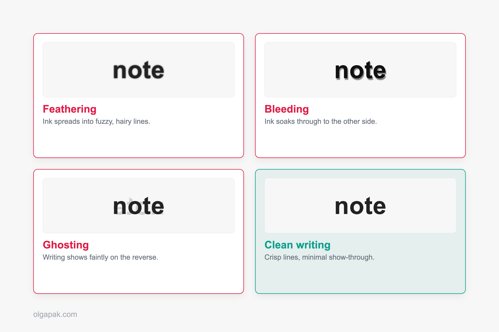
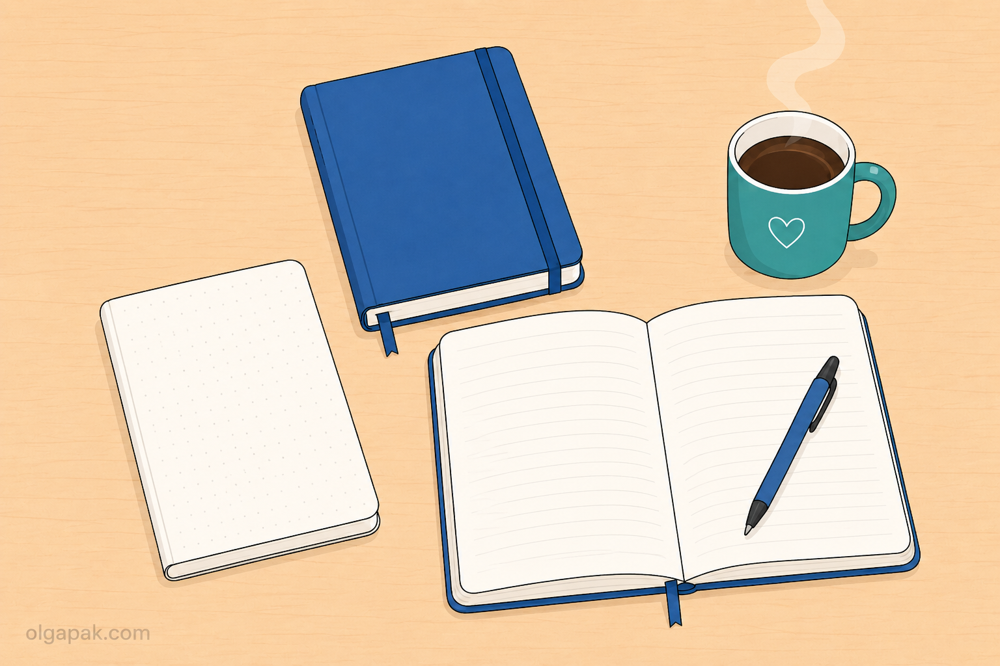
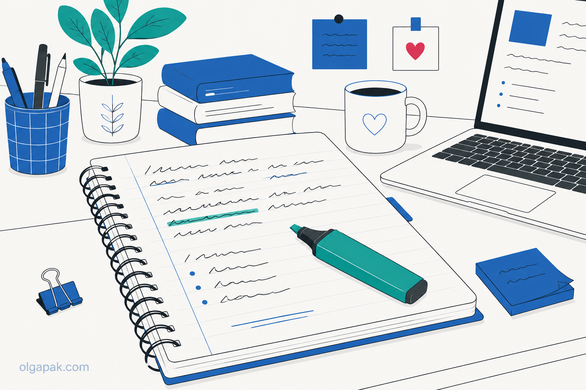
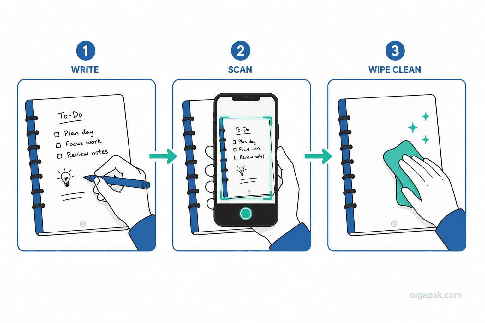

In a year when every productivity app wants to be your "second brain," the most underrated upgrade is still a plain notebook and a pen. The best notebooks for note-taking in 2026 aren't the smartest or the priciest; they're the ones that get out of your way so you can actually think.

I take a lot of notes. Pivoting careers, teaching myself to blog, sketching out AI tools by hand before I ever wrote a line of code: it all started in notebooks. I've also bought (and been quietly let down by) enough of them to know which ones survive a chaotic bag and which fall apart by week three.

If you already have a system, say the [Cornell method](/cornell-note-taking-method), the right ruled notebook makes it far easier to stick with.

This guide ranks 15 notebooks by what you'll actually use them for: school, work, budget, reusable, and premium, with a 60-second paper primer so you can pick with confidence. No hype, just honest trade-offs.

## What are the best notebooks for note-taking in 2026?

So which notebook is genuinely the best? It depends on the job, which is exactly why I sorted this list by use case instead of forcing one ranking. There's even research that [writing notes by hand may help you remember more](https://www.pbs.org/wgbh/nova/article/taking-notes-by-hand-could-improve-memory-wt/), so the paper you choose is worth a little thought.

Here's the short version:

- **Best all-rounder:** Leuchtturm1917 Hardcover Classic
- **Best budget:** Paperage or Muji
- **Best reusable:** Rocketbook
- **Best premium keeper:** Life Noble Note

The good news is that upgrading rarely costs much. Moving from a cheap notebook to a genuinely good one often adds just a couple of cents per page, and the paper is where you feel every bit of that difference. Aim for the 80–100 gsm range and you're most of the way there.

| Notebook | Best for | Size | Ruling options | Paper (gsm) | Price tier |
|---|---|---|---|---|---|
| [Leuchtturm1917 Classic](#leuchtturm1917) | All-purpose keeper | A5 | dot / lined / grid / blank | 80–90 | $$ |
| [Apica Premium C.D.](#apica) | Smooth paper | A5 | lined / graph / blank | 80–90 | $$ |
| [Moleskine Classic](#moleskine) | Light writers | A5 / pocket | lined / dot / grid / blank | thin | $$ |
| [Mead Five Star Spiral](#mead-five-star) | Students (mainstream) | Letter | college / wide | basic | $ |
| [Maruman Mnemosyne N194A](#maruman) | Dense class notes | B5 | lined / dot grid | premium | $$ |
| [Muji Notebook](#muji) | Budget minimalist | A5 / B5 | lined / dot / plain | basic | $ |
| [Rhodia dotPad / Webnotebook](#rhodia) | Meetings & to-dos | A5 / A4 pads | dot / lined / grid / blank | 90 | $$ |
| [Levenger Circa](#levenger-circa) | Reorganizing projects | Junior / letter | lined / dot / blank | 100 | $$$ |
| [Paperage Hardcover](#paperage) | Budget hardcover | ~5.7×8" | lined / dotted / blank | 100 | $ |
| [Oxford college block](#oxford) | Disposable work notes | Letter | college / wide | basic | $ |
| [Rocketbook Core / Fusion](#rocketbook) | Reusable / eco | Letter / exec | lined / dot grid | reusable | $$ |
| [reMarkable Paper Pro](#remarkable) | Paper-vs-digital | 10.8" tablet | n/a (e-ink) | e-ink screen | $$$ |
| [Midori MD](#midori) | Journaling | A5 / B6 | lined / grid / blank | toothy cream | $$ |
| [Life Noble Note](#life-noble) | Premium keeper | B6 | lined / grid | premium | $$$ |
| [Field Notes (3-pack)](#field-notes) | Pocket / on-the-go | Pocket | graph / lined / blank | varies | $ |

## How to choose a notebook for note-taking (what actually matters)

Before the picks, here's the 60-second version of what separates a great note-taking notebook from a frustrating one. You really only need to understand a handful of things.

Start with paper weight, measured in gsm (grams per square meter, basically how thick and heavy the paper is). For note-taking, 80–100 gsm is the sweet spot: heavy enough to resist ink problems, not so heavy the notebook turns into a brick. Thicker isn't automatically better.

Which ink problems? There are three, and knowing [the difference between feathering, bleeding, and ghosting](https://fountainpenlove.com/fountain-pen-education/whats-the-difference-between-ink-feathering-bleeding-and-ghosting/) saves you a lot of disappointment:

- **Feathering:** ink spreads out from your letters into fuzzy, hairy lines.
- **Bleeding:** ink soaks all the way through to the other side of the page.
- **Ghosting (show-through):** you can faintly see your writing on the reverse. Mild ghosting is normal; heavy ghosting is annoying.

Worth saying plainly: all three of these are a pairing problem, not a paper problem. The same notebook behaves completely differently depending on what you write with, so it's worth picking [the best pens for note taking](/best-pens-for-note-taking) alongside the paper rather than after it.

After paper, the rest is quick. Ruling is personal: most classroom notebooks use roughly 7 mm college ruling, and beyond that you're choosing between lined, dot grid, graph, and blank. Binding matters more than people expect. A notebook that lies flat is a joy; one that fights you shut is not. And size is a portability call: A5 is the do-everything default, B5 gives you more room for class notes, and pocket sizes go everywhere. Then it's just price tier.

## Best all-purpose notebooks for everyday note-taking

These are the do-everything picks: one notebook, any kind of note, no fuss. If you want a single answer to "which one should I buy?", start here.

### Leuchtturm1917 Hardcover Classic (A5)

The [Leuchtturm1917](https://www.amazon.com/dp/B0095FFUM4) is the notebook I hand people when they ask for one reliable keeper. The hardcover version comes with numbered pages, a ready-made index, two ribbon bookmarks, and your choice of dot, lined, grid, or blank, which is why it's the bullet-journal crowd's default. Best for anyone who wants a single do-everything notebook that lasts. The honest trade-off: the paper is on the thinner side, so heavier ink can ghost through, and the ruling is a tight 6 mm that feels cramped if your handwriting runs large. Price tier: $$.

### Apica Premium C.D. (A5)

If you write with a fountain or rollerball pen, the [Apica Premium C.D.](https://www.amazon.com/dp/B006ZSQWP8) is a quiet revelation. It's a simple softcover with silky, smooth paper that shows ink beautifully, and testers regularly rank it among the best all-purpose notebooks going. Best for anyone chasing that glide-across-the-page feel. The trade-off: it's stripped back, with no ribbon, no page numbers, and no index, and super-smooth paper isn't for everyone (some people want a little tooth to grip the pen). It sits at the mid price tier: $$.

### Moleskine Classic

The [Moleskine Classic](https://www.amazon.com/dp/8883701127) is the famous one, the little black hardcover you've seen in every coffee shop. Here's the honest version: it's genuinely fine with pencils, ballpoints, and gel pens, but its thin paper ghosts and bleeds the moment you reach for a fountain pen or a marker. Note-takers have grumbled about the paper for years, and it's a fair complaint that [an independent review of Moleskine's paper](https://www.penaddict.com/blog/2017/11/13/moleskine-classic-notebook-review) lays out plainly. One tip: newer Moleskines made in Germany or Vietnam handle ink better, so check the country of origin on the label. Best for light writers. Price tier: $$.

## Best notebooks for students (class and lecture notes)

Class notes have their own demands: you write fast, you fill pages quickly, and the notebook has to survive being crammed into a bag between lectures. Durable, affordable, and quick to flip through beats fancy here, and if you pair the right notebook with a system like [focused note-taking](/focused-note-taking-how-to-guide), you'll actually keep up. Most classroom notebooks use roughly 7 mm college ruling, which is the sweet spot for everyday handwriting.

### Mead Five Star Spiral

The [Mead Five Star Spiral](https://www.amazon.com/dp/B0CWS28VK1) is the bombproof American classroom staple, and it earns the spot. It's got a tough plastic cover, spiral binding, and perforated pages that tear out cleanly, and you can grab one at basically any store for pocket change. Best for students who want a cheap notebook that survives a semester in a backpack. The trade-off: the paper is basic. It's totally fine for ballpoint and gel pens, but skip it if you write with fountain pens. Budget price tier: $.

### Maruman Mnemosyne N194A

When your class notes get dense, the [Maruman Mnemosyne N194A](https://www.amazon.com/dp/B00SWVXZ5G) is the upgrade. It's a B5 twin-spiral notebook with genuinely premium paper, perforated pages, and a binding that lies completely flat, so you're not fighting the spiral halfway down the page. Best for heavy note-takers who want real quality plus the option to tear pages out for a binder. The trade-off: it costs more than a Five Star, and the plastic cover scratches and scuffs over time. Mid price tier: $$.

### Muji Notebook

[Muji notebooks](https://www.amazon.com/dp/B00GMJM2E0) are the no-logo, no-fuss option, and they're a students' quiet favorite for a reason. They're cheap, widely available, and the paper is surprisingly decent for what you pay. Best for anyone who wants clean, minimalist simplicity without a brand name stamped on the cover. The trade-off: they're basic by design, so don't expect ribbons, indexes, or thick fountain-pen-proof paper. If plain and affordable is the goal, though, they're hard to beat. Budget price tier: $.

## Best notebooks for work and meetings

Work notes are a different animal. Half of them are disposable (a to-do you'll cross off by lunch), and half are worth keeping (the project decision you'll need in three months). A lot of people quietly run a two-notebook setup: a cheap block for the throwaway stuff, and one nicer notebook for notes that matter. Pair either with [the outline method](/outlining-note-taking-method) and your meeting notes stop turning into an unreadable wall of text.

### Rhodia (dotPad + Webnotebook)

For fast meeting notes and to-do lists, [Rhodia](https://www.amazon.com/dp/B003UCL77U) is my pick. The bright white 90 gsm "R" paper is ultra-smooth, and the orange staple-bound pads tear off cleanly when you want to hand someone a page or bin a finished list. Prefer something bound to keep? The Webnotebook gives you the same lovely paper in a hardcover. Best for quick capture you'll toss, plus a nicer bound option for notes worth keeping. The trade-off: the pads are functional, not fancy. Mid price tier: $$.

### Levenger Circa (disc-bound)

The [Levenger Circa](https://www.levenger.com/collections/circa-system) is less a notebook and more a system. It's disc-bound, which means you can pop pages out, rearrange them, and add new ones like a binder, without the bulk of actual binder rings. The 100 gsm paper is a step up, too. Best for professionals juggling several projects who want their notes to move around as priorities shift. The honest trade-off: refills get pricey, and the whole thing is more commitment than a simple notebook. Premium price tier: $$$.

## Best budget notebooks (cheap but good)

Let's be honest: "best" doesn't have to mean expensive. Some of the most-loved notebooks online are the cheap-but-good ones, and if you're a student or just watching your spending, a well-chosen budget notebook will serve you just as faithfully as a premium one. You do not have to spend a fortune to take good notes.

### Paperage Hardcover

The [Paperage Hardcover](https://www.amazon.com/dp/B07L4JCG7T) is the pick I recommend most to anyone on a budget, because it punches so far above its price. You get a hardcover, 100 gsm paper, a ribbon, a back pocket, and a choice of lined, dotted, or blank, for the kind of money that usually buys something much flimsier. Best for a proper hardcover keeper without the premium price. The trade-off: the cover feels a touch cardboardy next to a Leuchtturm, but the paper is the real story here. Budget price tier: $.

### Oxford / a dirt-cheap college block

Sometimes the best notebook is the one you don't care about. An [Oxford spiral](https://www.amazon.com/dp/B00D3OR58A) or a plain college block is the throwaway half of the two-notebook strategy: the place for notes you'll act on and never reread. Best for disposable meeting and work notes, grocery-list thinking, the stuff that isn't worth your good paper. The honest note: the paper is basic, but that's entirely the point. Buy a stack, use them without precious feelings, recycle them guilt-free. Budget price tier: $.

## Best reusable and digital notebooks

Now the eco and digital options, honestly. Plenty of people swear that one analog notebook beats any app, and I get it; the whole appeal of paper is that it doesn't ping you. So I'll keep this honest rather than hype the gadgets. But if you already digitize everything, or you're weighing a tablet against a stack of notebooks, these two are worth knowing. And if you're still on the fence about the medium itself, my [digital vs paper notes](/digital-vs-paper-notes) breakdown covers what the research actually says. If your real goal is capturing meetings automatically, though, that's more the job of [AI note-taker apps](/best-ai-note-taker-apps) than a notebook.

### Rocketbook (Core / Fusion)

The [Rocketbook](https://www.amazon.com/dp/B0DP3HLY4J) is the clever one. You write with a Pilot FriXion pen, scan each page with the free app (it fires your notes off to Google Drive, Slack, Trello, or OneNote), then wipe the whole thing clean with a damp cloth and start over. Best for students and pros who digitize everything and hate wasting paper. The trade-off: you're committed to the app and FriXion pens, the paper feels a little slick under the pen, and you only get so many pages before a wipe. Mid price tier: $$.

### reMarkable Paper Pro (or Kindle Scribe)

If you're genuinely torn between paper and a screen, an e-ink tablet like the [reMarkable Paper Pro](https://www.amazon.com/dp/B0DGBDR2PM) (or Amazon's Kindle Scribe) is the honest middle ground. The writing feels close to real paper, and everything is searchable and syncs across your devices. Best for the reader actually weighing "notebook or iPad?" (If that is you, I have a full guide to [taking notes on an iPad](/how-to-take-notes-on-ipad), including when paper still wins.) The trade-offs are real, though: it's a serious investment next to a paper notebook, and some features, like handwriting search, sit behind a subscription. This is a considered purchase, not an impulse buy. Premium price tier: $$$.

## Best premium notebooks for journaling and keeping

Finally, the keepers: the notebooks you'll finish and actually want to shelve. This is where paper stops being a tool and starts being a small pleasure, and where the [aesthetic notes](/how-to-make-aesthetic-notes-complete-step-by-step-guide) crowd and journalers find their people. There's real joy in filling a beautiful notebook cover to cover; ask anyone who's done it.

### Midori MD (A5 / B6)

The [Midori MD](https://www.amazon.com/dp/B003CT47ZU) is for people who love the writing itself. The cream-colored paper has a slight tooth that makes even a cheap pen feel considered, the whole thing is beautifully minimalist, and there's a ribbon to hold your place. Best for minimalists and journalers who want paper they'll look forward to filling. The trade-offs: there's a bold printed line down the center of each page that some people find distracting, and the plastic cover is thin, so it wants a little care. Mid price tier: $$.

### Life Noble Note (B6)

The [Life Noble Note](https://www.amazon.com/dp/B003YU2S8A) is the one enthusiasts get quietly emotional about. The Japanese paper is understated and superb, and the pocketable B6 size makes it a favorite for the "one notebook per project" habit. One Reddit writer devoted a single B6 Life notebook to each chapter of their PhD for five years and called it the best notebook they'd ever used. Best for a long-term record you'll be genuinely proud to shelve when it's full. The trade-off: it's a premium price, and it's harder to find in stores, so you'll likely order it. Premium price tier: $$$.

### Field Notes (3-pack)

[Field Notes](https://www.amazon.com/dp/B071Y41YY3) are the grab-and-go option, sold in packs of three little memo books that slip into a back pocket or a jacket. The rotating limited editions have a bit of a cult following, so there's a collectible charm on top of the utility. Best for capturing ideas anywhere and carrying something stylish in your everyday kit. The trade-off: they're small, so they fill up fast, and the paper quality shifts depending on which edition you grab. Budget price tier: $.

## How to pick the right notebook for you

Still deciding? Map yourself to a pick:

- **On a tight budget?** Paperage, Muji, or a Mead Five Star.
- **Taking a lot of class notes?** Maruman Mnemosyne or a Five Star spiral.
- **Living in meetings?** Rhodia pads, plus a cheap block for the throwaway stuff.
- **Want to go paperless-ish?** Rocketbook, or an e-ink tablet if the budget allows.
- **Want a keeper you'll be proud of?** Life Noble Note, Midori MD, or a Leuchtturm1917.

And the rule under all of it: the best notebook is the one you'll actually open every day. A pristine premium notebook you're scared to "ruin" is worse than a cheap one you happily fill.

## Turn a full notebook into something you'll use

Whatever you pick, the notebook is only half the job. It captures the thinking; the other half is turning a full notebook into something you can actually reuse later.

That second half is the mundane part I'd happily automate. When a notebook fills up, [try my free AI tools](https://olgapak.com/ai-tools): the Text Summarizer will condense a wall of longhand notes into a short, scannable recap so the good ideas don't get buried. Automate the mundane, and keep your energy for the notes worth writing.

## FAQ

### What is the best notebook for note-taking?

It depends entirely on what you're using it for, which is why this guide is sorted by use case. For a single do-everything notebook, the Leuchtturm1917 Hardcover Classic is my best all-around pick. If you're on a budget, the Paperage Hardcover or a Muji notebook give you most of the quality for a fraction of the price. And if you want to reuse the same pages and digitize your notes, the Rocketbook is the smart choice.

### What paper weight (GSM) is best for note-taking?

Somewhere in the 80–100 gsm range is the sweet spot for most note-takers. That's heavy enough to keep ink from bleeding through or ghosting badly on the reverse, but not so thick that the notebook becomes bulky and heavy to carry. Heavier paper resists ink problems even better, but you pay for it in weight and page count, so thicker isn't automatically the right call.

### Is Moleskine good for note-taking?

It's fine for a lot of people and frustrating for others, and the deciding factor is your pen. With pencils, ballpoints, and gel pens, a Moleskine Classic works well. The trouble is its thin paper, which tends to ghost and bleed with fountain pens and markers. If you want one, check the country of origin on the label, since newer Moleskines made in Germany or Vietnam handle ink noticeably better than older stock.

### Are reusable notebooks like Rocketbook worth it?

Yes, if you digitize your notes and hate wasting paper. A Rocketbook lets you scan each page to apps like Google Drive or OneNote, then wipe it clean and reuse it. The catch is that you have to commit to the app and to special Pilot FriXion pens, and the paper feels a little slicker than a normal notebook. If you love the ritual of pen on regular paper, it may not win you over.

### What's the best cheap notebook for students?

A Mead Five Star spiral, a Muji notebook, or a Paperage Hardcover all give you real quality on a student budget. Many students also run a two-notebook strategy: a cheap block for everyday class and work notes you'll toss, and one nicer notebook reserved for material worth keeping. That way you're not burning good paper on a grocery list, and you still have a keeper for the notes that matter.
