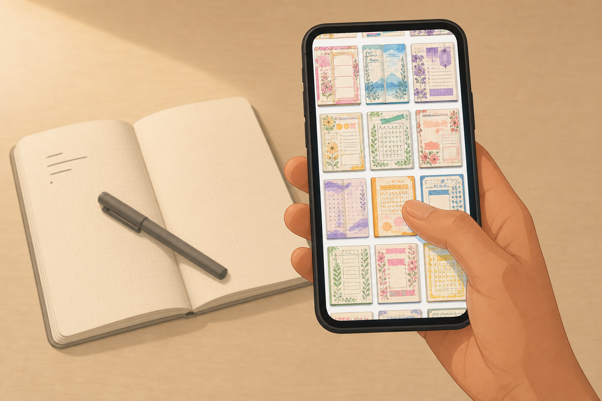
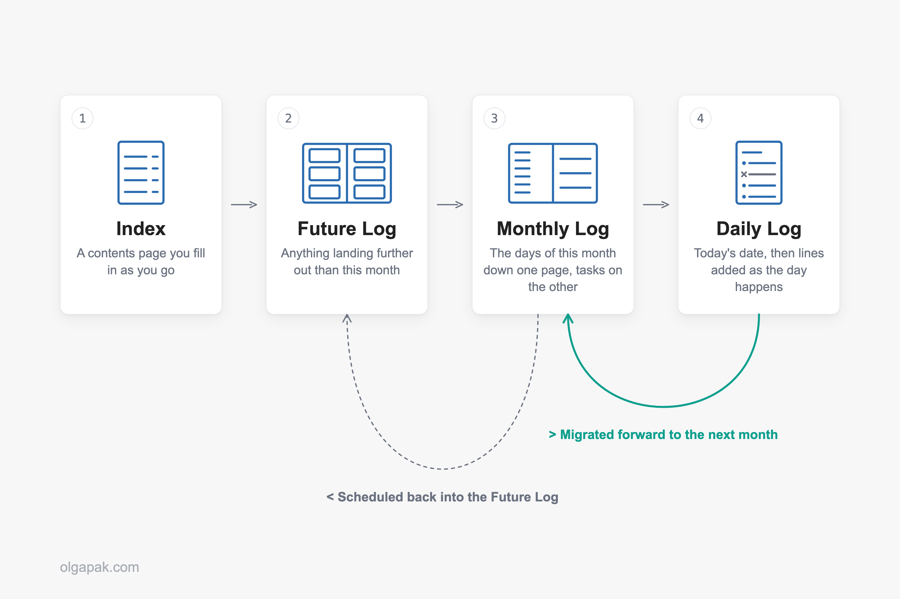
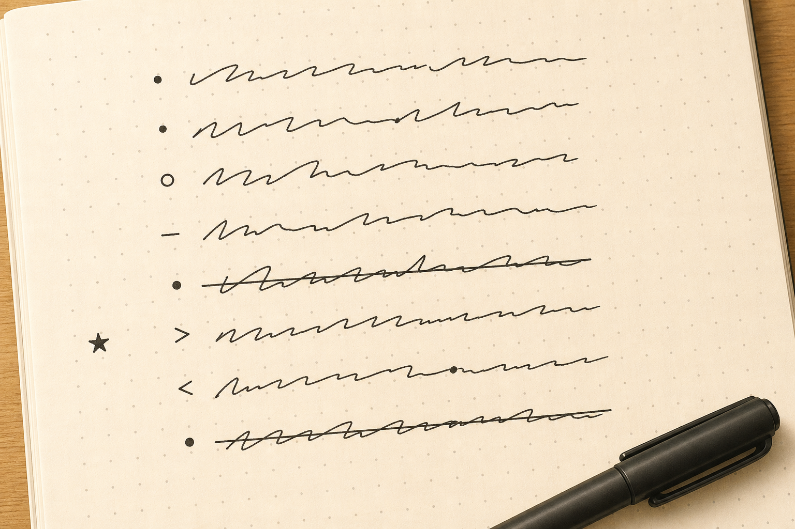
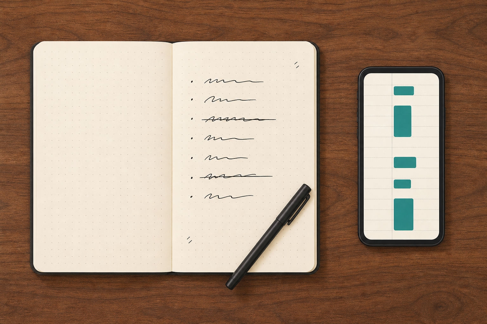

Almost everyone who searches "bullet journal for beginners" has already seen one they could never make: the hand-lettered spread, the four pen colors, the tiny watercolor banner reading "August". That page is the reason a lot of people never start, and it has almost nothing to do with the method.

After pivoting out of a decade in aviation PR and going back for a Master's, I tried most of the planning systems the internet recommends, and the only ones that survived contact with a genuinely busy week were the boring, simple ones.

If you already have [a weekly planning routine](/how-to-plan-your-week) that works on a screen, this is the paper-first version of the same job. It asks for a pen and one sitting, not a new app and a subscription.

This guide covers what a bullet journal actually is, why the pretty pages put people off, the two things you genuinely need, a setup you can finish today, and the jobs the method is honestly bad at.

## What a bullet journal actually is

A bullet journal is a notebook method for tracking what already happened, organizing what's happening now, and planning what's coming, written in short lines instead of full sentences. That's the whole concept. Everything else is decoration.

It was [created by Ryder Carroll, a digital product designer](https://rydercarroll.com/) based in Brooklyn, who built it for himself long before anyone was filming it. The system he published runs on four pages: the Index, the Future Log, the Monthly Log, and the Daily Log. We'll build all four further down. For now the only thing worth knowing is that four is the number, and a beginner setup is finished when those four exist.

Two words you'll meet everywhere, translated once so they stop being mysterious. A *spread* is any page or pair of facing pages set up for a purpose, so a "weekly spread" is two pages laid out for a week. A *collection* is any list or page you make for one topic, so a page headed "books to read" is a collection. Neither word means anything fancier than that.

Now the part that never makes it into the thumbnail. The official Bullet Journal site lists its own extras as optional add-ons rather than requirements:

- Cover pages
- A gratitude log
- Habit trackers
- Mood trackers
- A finance log
- Long-form journaling, for days when short lines aren't enough

Those pages are what almost all bullet journal content online is actually about. By the creators' own description, they are the optional part. The four core pages are the system; the trackers are what people add once the system already works.

## The real reason beginners never start

Every bullet journal for beginners guide explains the method perfectly well. Explanation was never the bottleneck. What sits on top of the explanation is.

Ryder Carroll's own walkthrough is four minutes long, [has been watched more than 15 million times](https://www.youtube.com/watch?v=fm15cmYU0IM), and is eleven years old. People are still typing "how do I start" into Google every day. A method watched fifteen million times isn't under-explained. It's over-decorated.

So what are you actually looking at when you scroll past those spreads? The community that uses this thing daily has an unusually precise answer. "A lot of those elaborate, artsy spreads are really better defined as ['art about planning' rather than as a functional planning system](https://www.reddit.com/r/bulletjournal/comments/1q4ssdj/beginner_here_how_do_i_start_bullet_journaling_if/)," wrote u/reallybiglizard, replying to a beginner who had asked how to start without being creative. Art about planning. That is the most useful sentence I have read on this topic.

That gap costs people years. ["I put bullet journaling off for years cause I seen all these pretty perfect spreads and got intimidated"](https://www.reddit.com/r/bulletjournal/comments/1swqru9/what_are_some_of_you_best_personal_tips_for/), wrote u/Rainbow_Catnip in a thread on what actually helps beginners. Not put off for an afternoon. For years.

Even the people who own the method know it. The official Bullet Journal site opens its own beginner guide by conceding that for some people the method "feels like this intimidating organization system that's made for people with an artistic gift", then answers its own charge in the next breath: all you need is a notebook and a pen. When the creators are the ones talking you down off the ledge, the ledge is real.

I recognize that ledge. I put off building my own blog for months because HTML and CSS sounded like something you needed a qualification for. The first page took one evening. Face-palm city.

Which makes the diagnosis fairly simple. You are not failing at a difficult system. You are looking at a hobby that grew on top of a simple one, and mistaking the hobby for the entry fee.

## What you actually need to start

Two things. A notebook and a pen.

That isn't me being cute for effect. In the same r/bulletjournal thread, u/SunnyClime told the beginner asking exactly this: "Any notebook and writing tool are absolutely enough. You could do it in composition notebooks with school pencils if you wanted to." The official site says the same thing in its own opening paragraphs.

Meanwhile the guides sitting at the top of Google will hand you a shopping list before you have written a single line:

- Fineliners, in three widths
- Dual-tip brush markers
- A lettering set
- A circle maker
- One specific dotted notebook

Do you already own a notebook with fifteen pages used and the rest blank? That is the one.

Dotted paper is a preference. Not a requirement. Lined, blank, squared, the back half of an abandoned university notebook, all of it works, because the method is a way of writing rather than a way of drawing.

Now the honest other half, because stationery does matter a little. A notebook you like the feel of genuinely does make you more likely to open it, and that is the only real argument for spending anything at all. If you reach the end of a month and want to upgrade, I've tested [which notebooks are actually worth the money](/best-notebooks-for-note-taking) and [a pen you'll enjoy writing with](/best-pens-for-note-taking). Do that in month two. Not tonight.

## How to set up your bullet journal in one sitting

The official order goes: pick a notebook, decide what you want out of this, then build the Index, the Future Log, the Monthly Log, and the Daily Log, in that sequence. Migration comes at month's end, so it gets its own section below. All of this is doable in one sitting with one pen.

Before the pages, write one line at the top of the first page about why you're doing this. You'll reread it in week three, when the novelty has gone.

### Step 1: The Index

Leave the first two pages blank. Write "Index" at the top of the first one. Step done.

The Index is a contents page for a book you haven't written yet. As you fill pages, number them in the corner and add a line here: "Monthly Log, August, p. 4". Nothing more elaborate.

Beginners ask this more than anything else: where does the Index go?

At the very front, always. It goes first because a bullet journal isn't laid out by date the way a pre-printed planner is, and without a contents page you have a box of paper you can only flip through.

### Step 2: The Future Log

Turn to the next spread. The Future Log is a spread divided into months, holding anything landing further out than the month you're in: a wedding in November, a deadline in March, the dentist.

Give it two pages, six months to a page. Rule a couple of lines to split each page into three blocks, write a month name on each, done. No grid. No ruler-perfect boxes. Every planning setup I have ever abandoned was one that needed a ruler. If a line comes out crooked, the appointment still happens.

This is the page that makes the whole thing feel less precarious, because it means you can stop holding next spring in your head.

### Step 3: The Monthly Log

Next spread. Down the left page, write the number of every day this month, one per line, with the first letter of the weekday beside it. On the right page, a plain task list for the month.

That is genuinely it. It is not a calendar drawing, it's a list. Events sit on the left next to their date, tasks sit on the right. The left page quietly doubles as a record: at the end of the month you can run your eye down it and see where the time actually went. It takes a few minutes, and the second month takes less.

### Step 4: The Daily Log

Today's date as a heading. That is the entire setup.

Then you add lines as the day happens, not before. A task occurs to you, you write it. When the day runs out you stop, and tomorrow gets its own heading on the next free line.

This is the single biggest difference from a pre-printed planner, and it is the reason a bullet journal survives a week going sideways. You never set tomorrow up in advance, so there is no pre-printed Tuesday sitting empty and accusing you of failing at Tuesday.

Once the day's tasks are on the page, the natural next move is to [give each of them a slot in your day](/time-blocking) instead of leaving them as a list to feel guilty about.

## Rapid logging: the symbols that do all the work

*Rapid logging* is the official name for writing in short bulleted fragments instead of sentences. "Call the letting agency" beats "I really need to remember to call the letting agency tomorrow morning". Same information, a fifth of the ink, and a page you can scan at a glance.

Each fragment gets a mark in front of it so you can tell at a glance what kind of thing it is. The entire notation is five marks:

| Mark | What it means | Example |
|---|---|---|
| `•` | A task, something to do | `• Email the tutor` |
| `o` | An event, something that happens | `o Dentist, 3pm` |
| `-` | A note, worth remembering, no action attached | `- She prefers email to calls` |
| `>` | Migrated, moved forward to the next day or month | `> Draft the proposal` |
| `<` | Scheduled, moved back into the Future Log | `< Book flights` |

Five marks, and you'll have them memorized by Thursday. When a task is finished, cross it off however you like. The notation doesn't police that part.

One more word you'll run into: a *signifier* is a small mark in the left margin that flags a line as special. A star means important, an exclamation mark means idea. That is the whole feature. It exists so your eye can find the two lines that mattered on a crowded page.

## Migration: the step it's tempting to skip

*Migration* is the step where, at the end of a month, you go back through the unfinished tasks and copy the ones that still matter forward into the new month by hand. By hand is the important part.

It feels like busywork the first time you do it. It isn't. Copying a task out again costs you a few seconds of attention, and a few seconds is exactly enough to notice that you have now rewritten "sort out the pension thing" three months running without ever doing it.

So what happens to a task that's been sitting there? One of three things, and you decide on the spot:

- You rewrite it into the new Monthly Log, because it still matters (`>`)
- You push it into the Future Log, for a month when it's actually realistic (`<`)
- You cross it out, because you were never going to do it and it has been quietly taxing you since spring

That third option is the one beginners don't expect, and it does most of the work. A digital to-do list will carry a dead task forever at no cost to anyone. A paper one charges you in handwriting every single month, and that price is what stops the list turning into an archive of guilt.

There's a quieter benefit too. Two psychologists at Florida State found that [an unfinished task keeps intruding on your attention until you make a specific plan for it](https://users.wfu.edu/masicaej/MasicampoBaumeister2011JPSP.pdf), at which point the intrusions stop even though the task is still sitting there undone. Note the condition. Not writing it down, not meaning to get to it: deciding what actually happens to it. Migration is that decision, once a month, in your own handwriting.

Skipping migration is tempting precisely because it is the only part of the method that asks anything of you. It is also the only part that does the deciding.

A task should have to earn its place on tomorrow's page. It shouldn't inherit one.

## What a bullet journal is bad at

Here is the part the top-ranking guides leave out. There are jobs a bullet journal is simply bad at, three of them, and none are fixable with a better layout.

- **It cannot remind you of anything.** A page does not buzz. If a thing must not be forgotten, paper is the wrong container.
- **It is poor as a live calendar.** Rescheduling means crossing out and rewriting, and a month of reschedules looks like a crime scene.
- **It is slow when your tasks change hour to hour.** Rewriting by hand is a feature at the end of a month and a tax at 11am on a Tuesday.

One commenter in the minimalist r/BasicBulletJournals put the first limit plainly. ["What the journal can't do is issue reminders"](https://www.reddit.com/r/BasicBulletJournals/comments/1q3k0vv/help_bujo_good_for_organizing_tasks_but_not_so/), wrote u/ptdaisy333, in a thread asking whether the method is any good for appointments. "It's a journal."

What that thread converged on isn't loyalty to paper. It's a split. "For me, it's b, and I'm keeping appointments in Google Calendar," wrote u/Fun_Apartment631, the thread's top commenter, picking the option that said the method isn't much of a calendar. At least five people in the same thread described the same split, with appointments and reminders living in a digital calendar and the notebook keeping everything else.

Should you be doing any of this on paper, though? Worth asking honestly, and the answer has more caveats than the internet allows: [what the research on paper versus screens really found](/digital-vs-paper-notes) is messier than "handwriting wins", and the strongest version of the claim doesn't replicate cleanly. Scientific American's framing is about posture rather than superiority: many people, it writes, ["approach computers and tablets with a state of mind less conducive to learning than the one they bring to paper"](https://www.scientificamerican.com/article/reading-paper-screens/).

So if your week is mostly meetings that move, a notebook will lose to a calendar app, and no amount of setup will change that.

## How to keep it going past week two

Do you know the feeling of a notebook that just stops halfway through March?

Week one is easy. Week three is where bullet journals go to die, and usually the system didn't fail, the ritual just never formed. Consistency here is a scheduling problem, not a character flaw.

The most useful tip I found came from u/lizzyote in [an r/bulletjournal thread on personal tips](https://www.reddit.com/r/bulletjournal/comments/1swqru9/what_are_some_of_you_best_personal_tips_for/): "Open your journal every single day. Keep the habit of opening your journal daily even if youre not going to write in it." Opening it is the habit. Writing in it is just what sometimes happens next.

Three things to not do, all of which I have watched people do:

- **Don't add extras until the four core pages have survived a month.** Habit trackers, reading logs, *threading* (writing a page number in the margin to point at where a topic picks up later): all of it is fine, and all of it is week six.
- **Don't start a second notebook.** One person in r/Travelersnotebooks described exactly how that goes: running a second notebook alongside the bullet journal ["kind of killed my bujo habit because I had too many ways to process info"](https://www.reddit.com/r/Travelersnotebooks/comments/1pan7uc/new_to_travelers_notebooks_should_i_switch_from/). One person's experience, in a thread about a different format, but it matches a pattern worth avoiding.
- **Don't wait for January.** A bullet journal starts on a random Tuesday halfway through a month, because there is no pre-printed date to waste.

And on the days the pages look untidy, which they will, remember what the thing is for. "Don't get so obsessed with the shape of the journal that you forget that its purpose is to make you better at everything else," wrote u/BlueProcess in that same tips thread. "It's the stage, not the show."

## Start it badly, tonight

Open whatever notebook is nearest. Write "Index" on page one, leave page two blank, put today's date on the first free page after that, and add three lines about today. That is a bullet journal. You can decide in a month whether it deserves a nicer pen.

The notebook is for thinking and deciding, which is the part genuinely worth your handwriting. The mechanical work, reading something long and pulling out what actually matters, doesn't need a pen at all. That's the job I built the Text Summarizer for, so if that's where your evenings disappear, [try my free AI tools](/ai-tools) to automate the mundane and keep the page for the thinking.

## FAQ

### What do you put at the beginning of a bullet journal?

The Index, and nothing else. Leave the first two pages blank, write "Index" at the top of the first one, and fill it in as you go: page number, then what's on that page. It goes first because a bullet journal isn't laid out by date the way a pre-printed planner is, so without a contents page nothing is findable.

### How do you start a bullet journal step by step?

Four steps, one sitting. Leave two pages at the front for the Index. Set up a Future Log on the next spread, split into months, for anything further out than this month. Then a Monthly Log: the days of this month down one page, a task list on the other. Then a Daily Log, which is today's date as a heading with lines added as the day happens.

### What mistakes should beginners avoid?

Four common ones. Buying supplies before you have written a single line. Copying someone else's spread, which copies their life rather than their system. Waiting for January instead of a random Tuesday. And adding habit trackers before the four core pages have survived a month.

### Is a bullet journal good for ADHD?

The part people usually mean is migration. At the end of each month, it makes you rewrite every unfinished task by hand, so a stale list cannot quietly accumulate: each item is rewritten, pushed to a later month, or crossed out. Some people find that friction clarifying and some find it exhausting, and which camp you land in is not something an article can predict. Two weeks of doing it is enough of a test to know.
