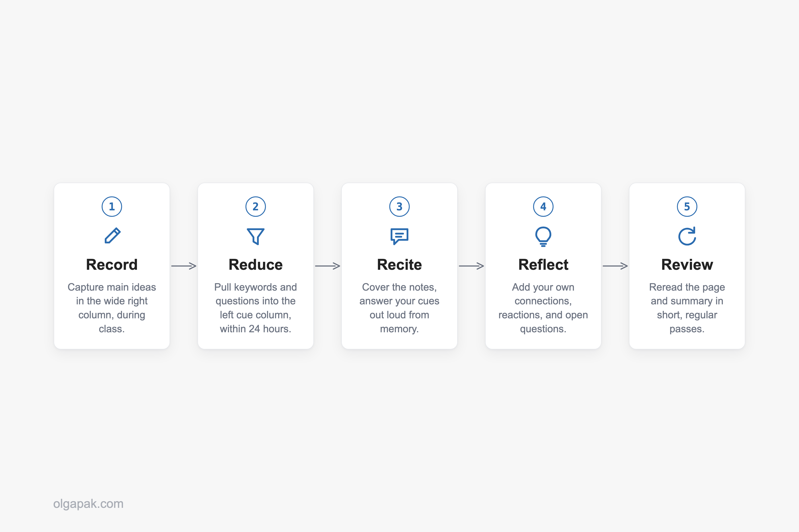
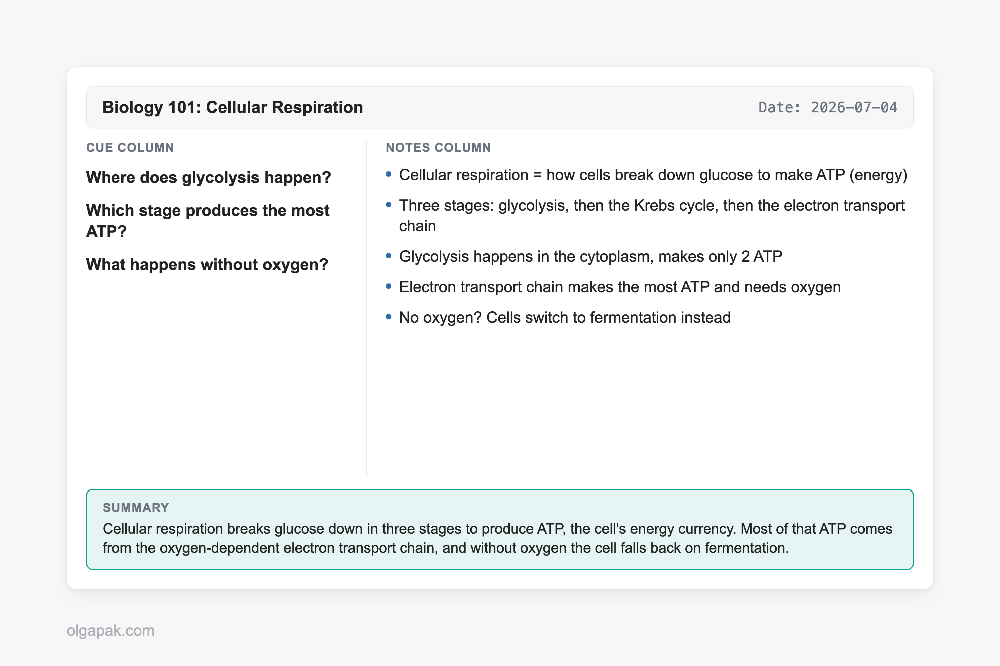
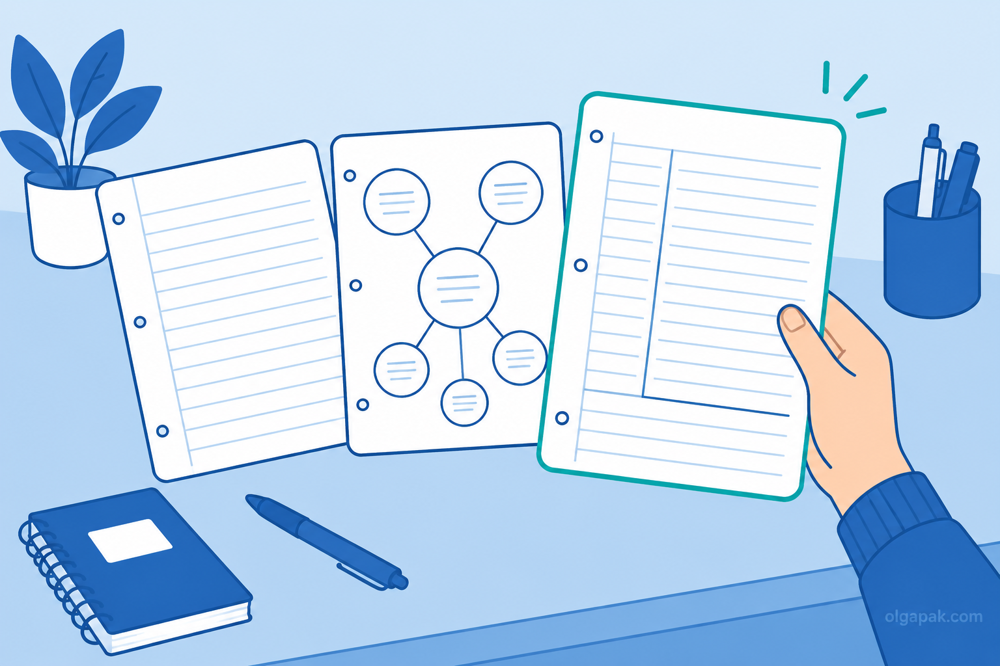

Ask around and you'll hear the Cornell note-taking method called two opposite things: the system that finally made notes stick, or just a fancy trend that looks tidy on the page and changes nothing. One r/studytips thread asked it in plain words: is it "worth it, or is it just a fancy trend?"

I went back to studying as an adult, pivoting out of a decade in aviation PR and into a Master's, and I had to relearn how to take notes that actually held up at exam time. So I have tested this one from the messy-notes starting line, not from behind a lecture podium.

If you've read my guide to [focused note-taking](/focused-note-taking-how-to-guide), think of this as its structured cousin: the same goal of notes you can genuinely use later, with a different shape on the page.

This guide covers what the method really is, the exact page layout, the five steps, a filled-in example you can copy, when to use it (and when to reach for something else), whether the research actually backs it up, and a free template to grab.

## What the Cornell note-taking method is (and why splitting the page matters)

The Cornell note-taking method is a single page divided into three zones: a narrow left column for keywords and questions, a wide right column for your actual notes, and a bar across the bottom for a short summary. That's the whole system. One page, three jobs.

The idea underneath it is more interesting than the layout. Writing down what you hear and making sense of what you heard are two different mental tasks, and most messy notebooks fail because they try to do both in the same cramped space. Cornell gives each task its own room. As knowledge-work writer Rob Lambert puts it, information and sense-making are different cognitive acts, and the method keeps one from drowning out the other.

Here's what lives where:

- **Left (the cue column):** short keywords, prompts, and questions you add after class. "Cue" just means a memory trigger, a hint that pulls the full answer back out of your head.
- **Right (the notes column):** what you capture live during the lecture, meeting, or reading.
- **Bottom (the summary):** two or three sentences, in your own words, written last.

The method isn't new, and that's part of why it keeps circulating. Walter Pauk, an education professor at Cornell University, developed it in the 1950s and laid it out in his book *How to Study in College*. Seventy years later, students and professionals are still splitting the page the same way.

## The Cornell page layout: cue column, notes, and summary

Getting the proportions right matters more than it looks, because the layout is what forces the behavior. Set it up wrong and you drift back into one undivided wall of text.

Draw a vertical line down the page so the right notes column ends up about twice as wide as the left cue column, then rule off five to seven lines (roughly two inches) across the bottom for the summary, matching [the official Cornell layout](https://lsc.cornell.edu/wp-content/uploads/2015/10/Cornell-Note_Taking-System.pdf). Many people also add a small header block at the very top for the date, class, and topic, which turns a loose stack of pages into something you can actually find later.

So why the lopsided columns? Because the wide side is where fast, live capture happens, and the narrow side is deliberately too small for full sentences. That constraint is the point: it nudges you to distill, not transcribe.

A few setup notes that save headaches:

- Keep the cue column empty during class. You fill it in afterward, when you actually have a spare thought to think.
- Don't crowd the summary bar with more lines. Two inches is enough, and a tight box keeps the summary honest.
- One topic per page where you can manage it, so the header and summary stay meaningful.
- A fine tip earns its keep in the cue column, where the space is deliberately tight. If you colour-code your cues, it's worth choosing [the right pen for note taking](/best-pens-for-note-taking) rather than whatever is in the bag.

## How to take Cornell notes: the 5 R's

The workflow has a tidy name: Walter Pauk's "5 R's." Each R is one small habit, and together they turn a page of notes into something you can study from instead of just store.

Here they are in order:

1. **Record.** During the lecture or meeting, write your notes in the wide right column. Go for main ideas and telling details, not a word-for-word transcript.
2. **Reduce.** Ideally within 24 hours, while it's still fresh, go back and pull keywords and questions into the left cue column. This is where you decide what actually mattered.
3. **Recite.** Cover the right column, look only at your cues, and answer them out loud from memory. This is active recall, the simple act of pulling information out of your head rather than just re-reading it in front of you.
4. **Reflect.** Add your own reactions: how this connects to last week, where you disagree, what still feels fuzzy. This is the step that makes the notes yours.
5. **Review.** Reread the page and your summary regularly, in short passes, so the material doesn't leak away before the exam or the follow-up meeting.

Notice how much of the value lands *after* the room empties. Recording is maybe a third of the method. The other four steps are where a passive page turns into recall you can lean on, and they take minutes, not hours. If writing your own cue questions is the step you keep skipping, some [AI study tools for students](/ai-study-tools) will generate a first set from your notes for you, though answering them from memory is still the part that does the work.

## A filled-in Cornell page: a worked example

Descriptions only get you so far, so let's fill one in. Picture an intro-biology lecture on cellular respiration, the process cells use to turn food into usable energy. Here's what a real Cornell page might look like afterward.

In the **right column**, captured live during the lecture, you'd have the raw material:

- Cellular respiration = how cells break down glucose to make ATP (energy)
- Three stages: glycolysis, then the Krebs cycle, then the electron transport chain
- Glycolysis happens in the cytoplasm, makes only 2 ATP
- Electron transport chain makes the most ATP and needs oxygen
- No oxygen? Cells switch to fermentation instead

Then, the next morning during **Reduce**, you cover the notes and ask yourself what a test would actually want. Those become the cues in the **left column**:

- Where does glycolysis happen?
- Which stage produces the most ATP?
- What happens without oxygen?

See what just happened? You didn't recopy anything. You turned your own notes into a mini quiz, which means every future review session is now a self-test instead of a reread.

Finally, the **summary bar** at the bottom, in your own words: "Cellular respiration breaks glucose down in three stages to produce ATP, the cell's energy currency. Most of that ATP comes from the oxygen-dependent electron transport chain, and without oxygen the cell falls back on fermentation." Two sentences, and you've just proven to yourself whether you actually understood the lecture or only attended it.

## When Cornell works best, and when to use another method

No method is right for everything, and the honest guidance here is the part most guides skip. Cornell earns its keep when the material has enough structure to reduce and enough stakes to review.

It works best for:

- Lecture-heavy and reading-heavy subjects, where ideas arrive in a line you can distill afterward.
- Anything you'll be tested on, because the cue-and-recite loop is built for exactly that.
- Meetings you have to act on later, where the cue column becomes your list of decisions and follow-ups.

Where does it struggle? Very fast, equation- or diagram-heavy STEM lectures are the classic trouble spot, because splitting your attention between capturing and structuring in real time is a good way to fall behind. Freeform brainstorming is the other one: when the ideas haven't sorted themselves into a shape yet, a charting or mapping layout, or [the outline method](/outlining-note-taking-method), often fits better than three fixed boxes. If you are still weighing your options, here is how to [compare Cornell with the other note-taking methods](/note-taking-methods).

Here's the honest wrinkle, though. Plenty of real STEM students swear by Cornell anyway. As one engineering student on Reddit put it, "Been using this in engineering classes for a semester now and it honestly helps way more before exams than regular notes." The trick they've figured out is timing: during a firehose lecture you mostly just Record, and you do the Reduce and summary steps *after* class, when you can think. Cornell doesn't have to happen live to work.

## Does the Cornell method actually work? The honest answer

Time for the question the r/studytips crowd actually asked. The honest answer is that the research is mixed, not magic and not myth. Some studies find real gains, and others find no significant difference, so the layout alone is not a guaranteed grade boost.

On the encouraging side, a [2024 study found that Cornell training improved learners' comprehension](https://tpls.academypublication.com/index.php/tpls/article/view/8509). On the sobering side, other studies have found that students taught the method produced better-organized notes without a matching jump in test scores, which is why researchers still call the overall evidence mixed. The method is also [advocated in the wider education and clinical-teaching literature](https://pubmed.ncbi.nlm.nih.gov/36548929/). So: helpful structure, not a spell.

What *is* well supported is the mechanism Cornell forces on you. The cue-and-recite loop and the summary are both forms of retrieval practice, pulling information back out of your memory, which is one of the more reliable things you can do to make learning stick.

Which brings us to the summary row, the quiet hero of this whole system. It's also the step people skip. One reader confessed, "I tried this, but I'm too lazy to do the summary part. Does it actually work without it?" And another answered exactly right: "The summary is actually the most important part! It's what forces you to synthesize the info." They added that their grades jumped after they started doing it. Skip the summary and you've kept the tidy layout while throwing away the ingredient that does the work.

One claim worth handling carefully: you'll often hear that writing notes by hand beats typing them. Some research points that way, but it isn't settled, so I won't sell it as fact. Pick the format you'll actually keep up with, which is exactly where the next section lands.

## Paper vs digital, plus a free Cornell template

Paper or screen? This is the other question readers keep asking, and the research doesn't crown a clear winner. Studies here tend to run on small samples and land on ["no clear difference"](https://pmc.ncbi.nlm.nih.gov/articles/PMC9247713/). So the real answer is boringly practical: use whichever one you'll actually stick with. If you want the longer version, I dug into what the studies on [digital vs paper notes](/digital-vs-paper-notes) actually found.

On paper, a plain page with a hand-drawn line works fine, and a Cornell-ruled notebook or a legal pad saves you the ruling step if you take a lot of notes. If you're still choosing one, [the best notebooks for note-taking](/best-notebooks-for-note-taking) breaks down the options by use case.

[AFFILIATE_PLACEHOLDER: Cornell-ruled notebooks — add Amazon Associates links + disclosure once approved]

On screen, a template does the same job, and if the screen in question is a tablet, here is how to [set it up on an iPad](/how-to-take-notes-on-ipad) properly. So grab the free Cornell template that comes with this guide:

- A **printable PDF** you can run off in a stack and keep in a binder.
- A **Notion version** you can duplicate for every class or project, with the three zones already set up.

Both keep the proportions honest so you don't have to redraw the columns every time.

And about that summary row, the step everyone skips because it's genuinely the hardest: you don't have to draft it from a blank stare. Paste your page's notes into my free [Text Summarizer](https://olgapak.com/ai-tools) to get a rough two-to-three-sentence draft, then tighten it in your own words so the thinking stays yours. It lowers the friction on the exact step the research says matters most.

Cornell isn't the only way to lay out a page, and it plays well with its siblings. If you want the pages to look good enough to reread, here's [how to make your notes look good](/how-to-make-aesthetic-notes-complete-step-by-step-guide), and if your Cornell summaries are really meeting recaps in disguise, my guide to [writing a meeting summary](/how-to-write-a-meeting-summary) picks up where the summary bar leaves off.

## Try the free tools that draft your summary for you

You now have the whole method: the three-zone layout, the five steps, a filled-in example, honest guidance on when to use it, and a template to grab. The last bit of friction is that summary row, and it's the one step you shouldn't skip.

So let the mundane part run on autopilot while you keep the thinking. [Try my free AI tools](https://olgapak.com/ai-tools) to draft that summary row for you, then tighten the wording yourself.

## FAQ

### What are the three parts of Cornell notes?

Three zones on one page: a narrow cue column on the left for keywords and questions, a wider notes column on the right for what you capture during class, and a summary bar across the bottom where you write two or three sentences in your own words. The cue column is roughly a third of the width, and the notes column is about twice as wide.

### Is the Cornell method actually effective?

Honestly, the research is mixed: some studies show comprehension gains and others show no significant difference in achievement. What's better supported is the mechanism it forces, the active recall you do through the cue column and the summary. In practice it works if you actually do the reciting and summarizing, not if you only draw the tidy layout and stop there.

### Can I use the Cornell method digitally?

Yes. A printable PDF, a Notion template, or a note-taking app all work, because the method is about how you split the page, not what you write on. Research shows no clear winner between paper and digital, so use whichever format you'll actually keep up with.

### What is the Cornell method NOT good for?

It struggles with very fast, equation- or diagram-heavy lectures where you can't split your attention in real time, and with freeform brainstorming before your ideas have a shape. In those cases, [charting method note-taking](/charting-method-note-taking) or mapping can fit better, or you can still use Cornell but do the cues and summary after class instead of during it.

### Do I really need the summary section?

Yes, it's the step with the biggest payoff, because it forces you to synthesize the whole page in your own words. It's also the part most people skip. If drafting it from scratch is what stops you, my free Text Summarizer can turn your notes into a rough summary you then tighten yourself.
