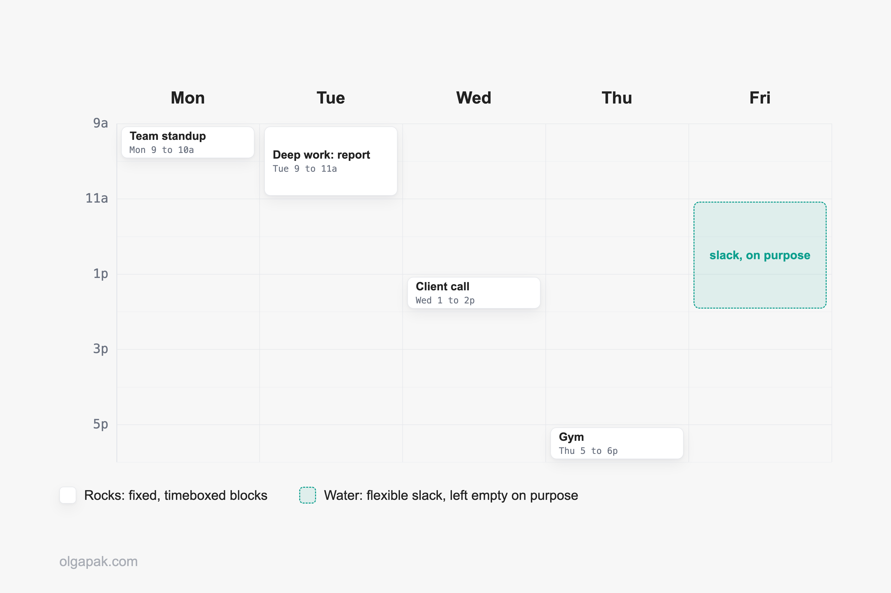

You sit down on a Sunday, coffee in hand, and map out a tidy week. By Tuesday it's already in pieces. If that loop feels familiar, the good news is that learning how to plan your week well has less to do with willpower than with deciding once, in advance, where your limited energy goes.

I write about productivity systems, and I lean on timeboxing (giving each task a set slot on my calendar) to stop work from swallowing my whole day. So this is a routine I actually run, not a theory I'm pitching.

I've shared [planning tips that actually stick](/planning-tips-to-maximize-productivity) before, but here I want to zoom in on one thing: a repeatable weekly routine you can set up this Sunday and still be using in March.

This guide covers why most weekly plans collapse, a simple five-step routine to build one that holds, and the part almost every guide skips: exactly what to do when the week goes sideways by Wednesday.

## Planning your week isn't about doing more

Let me answer the doubt first, because I had it too. Isn't planning just procrastination in a nicer outfit?

It can be, if you spend an hour color-coding a calendar you never open. But done right, planning is the opposite of busywork. It's a single decision, made while you're calm, that saves you twenty small decisions later when you're tired and the day is already loud. That's the real case for [the benefits of planning ahead](/benefits-of-planning-ahead-for-peak-productivity): you trade one thoughtful session for a week of fewer judgment calls.

Here's the reframe that changed how I plan. Instead of asking how many hours I have, I ask where my energy should go. The idea comes from a classic Harvard Business Review argument to [manage your energy, not just your time](https://hbr.org/2007/10/manage-your-energy-not-your-time), and it reframes the whole exercise.

A week has a fixed number of hours. But your focus, motivation, and patience rise and fall through it. Plan for where the energy should land, and the hours start to take care of themselves.

## Why most weekly plans fall apart

Most weekly plans don't fail because you're lazy. They fail because they were built for a perfect week: no interruptions, steady focus, everyone else cooperating.

Productivity writer Sheena McGinley names the culprit exactly: "Idealism causes people to make structured weekly plans without considering interruptions, shifting priorities, or energy fluctuations, which widens the gap between intention and execution." A plan with no gaps has nowhere to put the unexpected, so the first surprise (a sick kid, a last-minute meeting, a flat tire) tips the whole thing over.

One community framing I keep coming back to sorts your week into rocks and water. As one r/productivity commenter put it, you "let the water flow into the empty spaces between the rocks":

- **Rocks:** fixed commitments that can't move (classes, shifts, appointments).
- **Water:** flexible work that can flow around them (errands, email, project tasks).

You place the rocks on the calendar first, then let the water fill the gaps between them, instead of trying to schedule every single drop. That one shift is the difference between a plan that bends and a plan that breaks.

## How to plan your week, step by step

So here's the routine itself: five steps, done in one sitting, once a week. The goal isn't a flawless schedule. Another r/productivity commenter summed it up: "I don't plan every minute, I plan for momentum." That's the spirit of everything below.

### Step 1: Reflect on last week and empty your head

Start by looking backward for five minutes. What got done? What didn't, and does it still matter? What's carrying over into this week? Then empty your head onto one page: every open loop, task, and half-remembered errand, out of your brain and somewhere you can see it.

This part is real work, and I want to be honest about that. Tara Viswanathan, who has used the same simple structure for over eight years, says forming her weekly plan "takes me 45 min to 1 hr ... including reflection from last week." Reflection isn't the warm-up. It's half the value.

### Step 2: Choose your priorities (your "rocks")

Now pick what actually matters this week. Not everything: two to four things. These are your rocks, the outcomes you'd be genuinely glad you protected if the week got messy.

Choosing well is its own skill, so if that's where you stall, it helps to get clear on [how to stay focused on your goals](/how-to-stay-focused-on-goals) before you touch the calendar. One creator I read frames the choice around progress rather than tasks: "Most people plan their week around tasks. I plan mine around progress." Pick the handful of things that move you forward, and let the rest stay optional.

### Step 3: Give each priority a slot (timeboxing)

Now give each rock a home. Timeboxing means blocking a specific chunk of time on your calendar for a specific task, so "write the report" becomes "write the report, Tuesday 9 to 11 a.m." instead of a vague someday. The task stops floating and gets an actual address.

I lean on this because of a stubborn little rule I kept bumping into: work expands to fill the time available for it. That's [Parkinson's Law](https://www.britannica.com/topic/Parkinsons-Law-or-The-Pursuit-of-Progress) in plain terms, and it's why an essay that could take ninety minutes will happily swallow a whole free afternoon. Give the task a box, and it tends to fit the box. If you want the deeper version, I've written a full breakdown of [how timeboxing works](/what-is-timeboxing).

### Step 4: Leave slack on purpose

Here's the step that saves the whole plan: leave empty space on purpose. A week packed wall to wall has nowhere to absorb the unexpected, so the moment reality intrudes, it snaps.

Productivity writer Jessica Massey calls this margin: "Margin is breathing room. It's your schedule's emergency fund for when your bestie calls and needs a listening ear or somebody throws up or you just need to take a breather for a minute." Block an hour or two of deliberate nothing across the week and treat it as real. The catch is that empty space is easy to lose without noticing, which is why it pays to [protect those focus blocks from doomscrolling](/how-to-stop-doomscrolling) before they quietly evaporate.

### Step 5: Keep one home for the plan

Finally, keep the whole thing in one place. One notebook, one app, one document, whatever you'll actually open. The fastest way to abandon a system is to start a shiny new one every Sunday.

A third r/productivity commenter put it bluntly: "a messy plan you actually follow is 100x better than a beautiful Notion dashboard you never open." Pick your one home and stay there until it's actually not working, not just until it stops feeling novel.

## The midweek reset: what to do when the plan breaks

So it's Wednesday, and the plan is already a mess. Two rocks slipped, something urgent ate your Tuesday, and the tidy schedule from Sunday looks like a small lie you told yourself. Do you throw it out and feel bad until next week? No. Here's the move almost no planning guide teaches: don't scrap the system, and don't wait for next Sunday to start over. Run a five-minute midweek reset instead.

The reset is small on purpose:

- Look at what's actually left, not what you hoped for on Sunday.
- Re-pick the one or two things that still matter.
- Re-slot them into the days you have left.
- Consciously drop the rest, without guilt.

That last part is the one people skip, and it's the most important. Dropping a task on Wednesday because the week changed isn't a failure of character. It's the recovery mechanism an idealistic plan never builds in. Remember McGinley's point about the gap between intention and execution: the reset is how you close that gap midweek instead of writing the whole week off.

And if "nothing ever sticks" is your default story, know that it's an incredibly common one, sometimes tied to how a brain is wired rather than any shortage of discipline. You're not broken for needing a reset. The reset works precisely because it assumes the plan will wobble. A plan you can repair on Wednesday beats a perfect one you quietly abandon.

## How long weekly planning actually takes

Let me set an honest expectation, because a lot of posts won't. A weekly plan takes real time and real thought.

On a light week, fifteen minutes is plenty: skim last week, pick your rocks, block a few slots. Add proper reflection and it climbs toward an hour, which lines up with the "45 min to 1 hr" Tara Viswanathan quotes for her own long-running system. So the honest range is roughly 15 to 60 minutes, depending on how deep you go.

What it won't be is a five-minute magic trick that fixes your life. Anyone promising that is selling something. A simple plan is simple to read, not effortless to make, and that's completely fine.

One person on X admitted her attempt "lasted exactly 17 minutes before I was daydreaming about my next trip instead." That's not a character flaw. It just means the session needs a container too: set a timer, keep it short, and stop when it rings.

## When you're truly overloaded, plan less, not more

Sometimes the honest answer isn't a better calendar trick. It's fewer commitments.

If you're a student in finals week juggling six classes, a job hunt, the gym, and a social life, no timeboxing scheme will manufacture hours that don't exist. When a week is genuinely overloaded, planning's job changes: instead of fitting everything in, it helps you decide what not to do. The bluntest advice I saw on this, from an r/productivity thread full of stretched-thin people, was two words: "Do less things."

The more useful version is to rank your commitments instead of trying to balance them. Put them in a hard order, protect the top one or two at full effort, and let the rest run in maintenance mode. For that overloaded student, ranking might look like this:

- The job application or exam that actually moves your future: full effort.
- Passing, not perfecting, everything else academic.
- Gym and social life: maintenance, whatever's left over.

It stings to write down. But naming the order out loud is far kinder than quietly failing at all of it at once. Planning can't create time. It can protect what matters most with the time you actually have.

## Tools that make weekly planning easier

You don't need a new app for this. You need three things you probably already own:

- A calendar for your rocks (the fixed blocks and timeboxed slots).
- One list for your water (the flexible tasks).
- One home for the plan, so you're not rebuilding it from scratch every week.

That's really it. The tools matter far less than picking a small set and sticking with them.

The one place a tool earns its keep is admin. Email, messages, and small replies leak across the whole week and quietly eat the slack you fought to protect. So I batch them into a single block and clear it fast. When that block is drafting replies, my free [Email Generator](/ai-tools) turns a one-line prompt into a first draft, so I'm editing instead of staring at a blank page. Contain the admin, and the rest of the plan gets room to breathe.

## Plan once, so you can stop deciding

A good weekly plan quietly removes decisions and busywork, so your energy lands on the things that actually move your week forward. That's the whole point: less grinding, more direction.

If you want a head start on the mundane parts, [try my free AI tools to automate the mundane](/ai-tools). They handle the small, repetitive writing tasks, so the time you just carved out goes to work that matters instead of your inbox.

## FAQ

### How do I plan my week when I don't know what's coming?

Separate your fixed commitments (your "rocks," like classes, shifts, and appointments) from your flexible work (the "water," like errands and email). Put the rocks on the calendar first, then leave deliberate slack so surprises have somewhere to land instead of breaking the plan. You're not predicting the week, you're building one that can bend.

### What's the best day to plan my week?

Sunday is the most common choice because it sits before the week starts, but the specific day matters far less than doing it on the same day every week. Consistency is what turns planning into a habit. Pick whichever day you'll actually keep, whether that's Sunday evening, Monday morning, or Friday afternoon.

### How long should planning my week take?

Roughly 15 to 60 minutes, depending on how much reflection you do. A quick version (skim last week, pick your priorities, block a few slots) takes about fifteen minutes; a fuller session with real reflection runs closer to an hour. A simple plan still takes real thought, so don't expect it to be effortless, and set a timer so it doesn't sprawl.

### What do I do when my weekly plan falls apart midweek?

Don't scrap it, and don't wait until next Sunday to start over. Run a five-minute midweek reset: look at what's actually left, re-pick the one or two things that still matter, re-slot them into the days you have left, and drop the rest without guilt. A plan you can repair on Wednesday beats a perfect one you abandon.

### Is planning every day worth it, or is it just productivity theater?

Plan the week for direction, then do light daily check-ins rather than rebuilding everything each morning. Planning tips into "theater" only when the system becomes the work instead of serving it. A messy plan you actually follow beats a beautiful one you never open, so keep it small enough to stick with.
