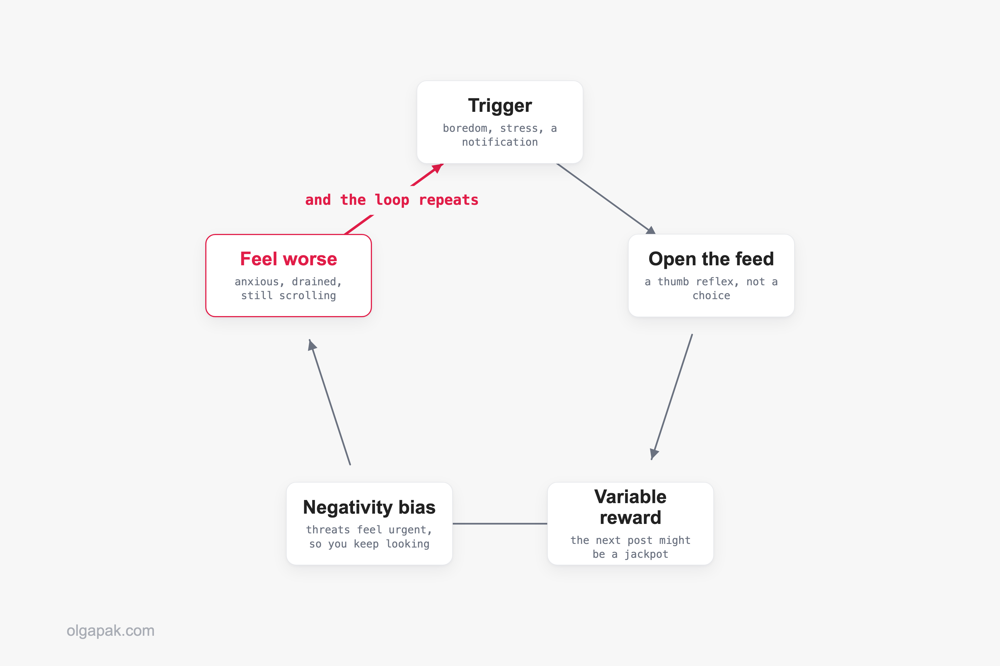
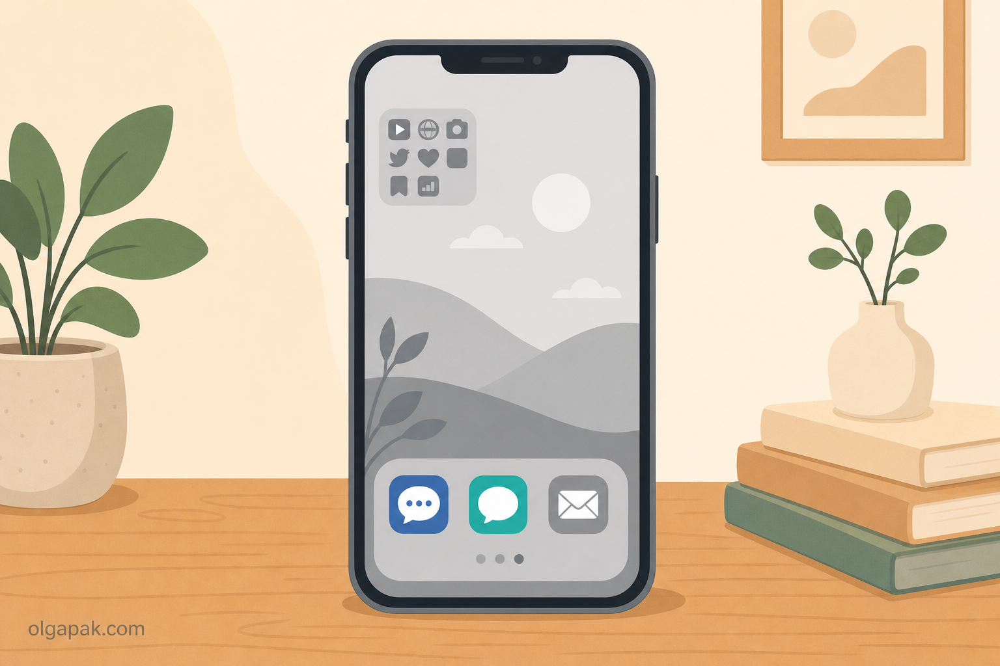
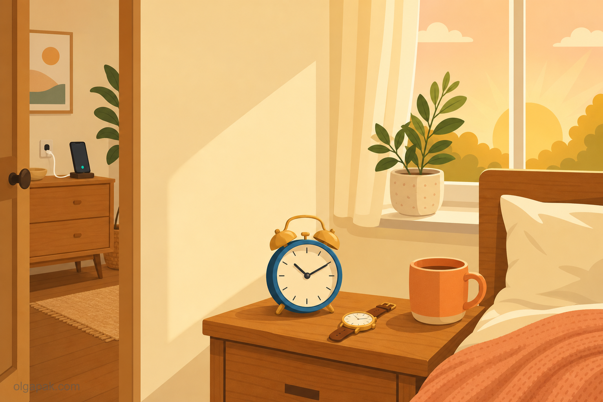

You pick up your phone to check one thing, and forty minutes later you surface feeling worse than when you started. That is doomscrolling, and if you have been searching for how to stop doomscrolling, the first thing worth knowing is that it was never really a willpower problem. As one reader put it, "I'll pick up my phone for what feels like five minutes and suddenly an hour has disappeared."

I have lost that hour too, more nights than I would like to admit. After years of blaming my own self-control, what finally worked was redesigning my environment and routines instead. That is the same tested-not-theorized approach I bring to every tool and tactic on this blog.

This is really about reclaiming your attention so you can [stay focused on what actually matters](/how-to-stay-focused-on-goals), not about white-knuckling your way past a glowing screen.

Below I cover what doomscrolling actually does to your brain, then 12 science-backed strategies grouped into three layers: reshape your environment, catch the trigger, and rebuild your routine. None of them require deleting your apps or going off the grid.

## What doomscrolling actually is (and why "just stop" never works)

So what is doomscrolling, exactly? It is compulsively scrolling through negative, comparison-heavy, or FOMO-inducing content, reels and news alike, long past the point where it still feels good. If that describes your evenings, you are not weak and you are not broken. You are using a product engineered to keep you doing exactly this.

Two things keep your thumb moving. First, feeds are built on [variable-reward schedules](https://pmc.ncbi.nlm.nih.gov/articles/PMC12322333/): your brain never quite knows whether the next post is a jackpot or junk, and that unpredictability is exactly what keeps it hooked. Second, doomscrolling layers on a [negativity bias](https://pmc.ncbi.nlm.nih.gov/articles/PMC9580444/), a pull toward anything that looks like a threat, so the feed always feels a little urgent even when nothing is actually wrong.

And it is not only the news. The same loop runs on reels, viral clips, and other people's highlight reels, so you can close the app anxious without having read a single headline. Psychologists even have a name for soaking up strangers' distress through a screen: vicarious trauma. Your nervous system does not always register that the crisis is not yours.

It genuinely makes you feel worse, too. During the pandemic, researchers found that [doomscrolling is associated with psychological distress](https://doi.org/10.1111/ppc.12803). So when you hold out for a few days and then slide back, that is the expected outcome, not a character flaw.

The real answer to how to stop doomscrolling is not more discipline. It is better design plus a real replacement. Deleting the app just moves the scroll, as one Redditor admitted: "i deleted instagram & twitter but now i just scroll on reddit all day instead." That insight is exactly what the next 12 strategies are built around.

## Layer 1: Reshape your environment (make the scroll harder to start)

The highest-leverage change is not willpower, it is friction. Make your phone a little boring and move the feeds a few steps further away, and the scroll gets much harder to start on autopilot. One reader described the trap perfectly: trying to quit while the phone is in your pocket is like being an addict trying to stop drinking, at a bar. Every extra second and every extra tap between you and the feed is quietly working in your favor.

### 1. Move the feeds off your home screen

Bury your social and news apps in a folder on the last home screen page, or delete the icon and keep the account. Opening one should take a deliberate search, not a thumb reflex. That tiny pause is often enough to catch yourself. A reader in r/ADHD said moving Instagram off the home screen makes opening it "a deliberate search instead of a thumb reflex". It does not fix the sadness, but it buys you a pause. Even better, log out after each session, so the app greets you with a login screen instead of your feed.

### 2. Make your phone boring: grayscale + kill notifications

Turn on grayscale mode so the whole screen drains to black and white, and switch off every notification that is not a real human trying to reach you. No red badges, no breaking-news pings. Going grayscale ["removes positive reinforcements"](https://www.wired.com/story/grayscale-ios-android-smartphone-addiction/), as former Google design ethicist Tristan Harris put it. The color is part of the reward, so take the reward away. Both iPhone and Android tuck a grayscale toggle in their accessibility settings, and you can map it to a quick shortcut so flipping it on takes a single tap.

### 3. Charge your phone outside the bedroom

The worst scrolling happens in bed, first thing and last thing. Charge your phone in another room and let it live there overnight. It matters more than it sounds: [in-bed use of social media is linked to insomnia and daytime sleepiness](https://doi.org/10.1016/j.sleh.2017.12.004), so the bedtime scroll costs you twice, first the lost hour, then the worse sleep. Between the blue light and the mental buzz of a feed, a screen-free bedroom is one of the highest-return changes on this whole list. Get a cheap alarm clock so your phone has no excuse to sit on the nightstand.

### 4. Keep messaging, cut the feeds (you don't have to deactivate)

You do not have to nuke your accounts, and this is the single most common question I see: how do I do this without deactivating? Keep WhatsApp, iMessage, and your DMs, the tools you use for real connection, and remove or bury only the infinite feeds. "Uninstall social media. Keep messaging apps," as one reader put it. Be honest about which apps are which: if it has an endless scroll of strangers' posts, it is a feed. And if you want your phone to still earn its keep, here are [productive things to do on your phone instead of scrolling](/productive-things-to-do-on-your-phone-instead-of-scrolling).

### 5. Use time limits and a delay app as a speed bump, not a wall

Built-in Screen Time limits and one-tap "wait 10 seconds" delay apps genuinely help, but be honest about what they are. Pure timers get tapped through, ignored, or reinstalled the moment you really want back in. Treat them as a speed bump that interrupts autopilot, not a lock that stops you. And if you do reinstall something, add the friction back the same day rather than treating the slip as proof you failed. The friction is the point, not the enforcement.

## Layer 2: Catch the trigger (work with your brain, not against it)

Most doomscrolling is not really about the phone. It is a coping reflex for a feeling: boredom, stress, sadness, avoidance. Catch the feeling and you get a small window to redirect before autopilot takes the wheel. "For me it's boredom plus avoidance," one reader wrote. "Once I catch that moment, I can sometimes stop before going full autopilot." The mindset that helps here, borrowed from writer Leo Babauta, is to become a scientist studying your own habits instead of a judge handing down a sentence.

### 6. Name the feeling before you unlock

Before you unlock, take five seconds and ask one question: what do I actually want right now? Name the emotion if you can, bored, anxious, lonely, tired. Habit-change researcher Dr Gina Cleo uses that exact question as her circuit-breaker. Naming an urge, sometimes called urge-surfing, loosens its grip just enough for you to choose something else. Jot it in a note if that helps, because the act of putting the feeling into words is what opens the gap.

### 7. Replace, don't just remove

This is the spine of the whole guide. Deleting an app without a replacement simply moves the scroll somewhere else. That is why the most-repeated failure online is deleting Instagram and then scrolling Reddit all day instead. Keep a specific alternative within arm's reach: a paperback or Kindle, an audiobook, a walk, a project you are actually excited about. As one reader put it, "you can't just STOP doomscrolling you have to START projects." Decide on that replacement before you are bored, not in the moment, because a tired brain always reaches for the easiest option. If you need a running list, here are [things to do instead of being on your phone](/things-to-do-instead-of-being-on-your-phone).

### 8. Stand up and move: the 30-second pattern interrupt

When you catch yourself mid-scroll, stand up and move for 30 seconds. Get water, look out a window, stretch your neck. It sounds almost too small to work. "Just standing up and walk around a little," one reader wrote, "idk why but it can refresh my brain." Some people pair it with saying "stop" out loud, a technique wellbeing writers recommend for exactly this loop. The goal is not to feel great, just to interrupt the loop long enough to make a different choice, and it needs no app at all.

## Layer 3: Rebuild your routine (design days that don't need willpower)

The durable fix is a day where the phone is not the default. When your morning and your evening are built to run without a screen, the scroll gets far less airtime, and you spend far less energy defending against it. Bookend your day, protect the first hour and the last, and the middle tends to look after itself. Dr Gina Cleo describes her own turnaround the same way: she did not stop by being more disciplined, she stopped by redesigning her habits, environment, and routines.

### 9. Protect a phone-free first hour

How you start the day sets its tone, so keep the first hour screen-free: no scroll before you are up, dressed, and moving. The trick is to fill that hour with intention rather than leave a vacuum, which is where [timeboxing your day](/what-is-timeboxing) helps. You give the morning a plan, so the phone is not the easiest thing to reach for. One reader found that charging the phone in another room "breaks the morning scroll, which sets the tone for the whole day."

### 10. Trade your phone alarm and clock for real ones

A phone on the nightstand gives you two innocent-looking reasons to pick it up: the time and the alarm. Both quietly turn into a scroll. A cheap alarm clock and a simple wristwatch remove those reasons entirely, so checking the hour never snowballs into 40 minutes of reels. The clock and a charging spot in another room become a small ritual that tells your brain the day has a shape.

### 11. Try the "two sources, two times a day" news diet

If your scroll is really a civic-duty spiral through the news, this one is for you. Psychologist Kimberley Wilson recommends a "Two by Two" approach: pick two good-quality sources and check them at only two set times a day, then stop. Turn off news-app notifications too, so the day's rhythm is yours and not the newsroom's. Staying informed does not require a 24/7 drip of alerts. You can be a responsible, well-read person and still put the feed down.

### 12. Be kind when you slip (relapse is designed in)

You will slip. The apps are built to make sure of it, so treat a lapse as data, not failure. Notice what set it off, then restart with the next tactic. One reader captured the shift better than any study: "at least I stopped thinking it's a personal flaw." Self-compassion is not the soft option here. It is what keeps you from rage-quitting the whole effort after one bad night. If you would rather roll these changes out one at a time instead of all at once, my [digital detox plan](/digital-detox-plan) spreads them across a week and tells you exactly what to do on the day you slip.

## Reclaim the hours, then spend them on purpose

Here is the quiet payoff: the hours you stop feeding to the feed do not vanish, they come back to you. You did not fail at the internet, you were up against a system designed to win, and changing that system is how you take the time back. The real win is not a smaller screen-time number, it is what you do with the attention you reclaim. Doomscrolling is one leak out of several, so if you want the whole picture rather than this one behavior, start with [how to reduce screen time](/how-to-reduce-screen-time).

So point it at something that matters. When you do have reading or writing to get through, [try my free AI tools](/ai-tools) to automate the mundane. The Text Summarizer turns a long article into a short, scannable version, so your reclaimed time goes to living instead of loading one more feed.

## FAQ

### What is doomscrolling, exactly?

Doomscrolling is compulsively scrolling through negative, comparison-heavy, or anxiety-provoking content, endless reels, bad news, and FOMO-inducing posts, long past the point where it feels good or useful. It is usually automatic rather than a conscious choice, which is why it can eat an hour before you notice.

### How do I stop doomscrolling without deleting my apps?

You do not have to deactivate anything. The trick is friction plus replacement: bury the infinite feeds off your home screen, keep your messaging apps for real connection, and always keep a specific alternative within reach, a book, a walk, or a project. Removing the account is rarely the part that fixes it.

### Why can't I stop doomscrolling even when I want to?

Because it is engineered, not chosen. Variable-reward loops keep your brain guessing whether the next post is worth it, and your natural negativity bias makes threatening content feel urgent. That makes doomscrolling a design problem, not a willpower or character problem, so the fix is to change the design around you rather than to try harder.

### Is doomscrolling actually bad for you?

Yes, and the research backs it up. Doomscrolling has been associated with psychological distress, and scrolling in bed at night is linked to worse sleep, partly because blue light from screens suppresses the sleep hormone melatonin. You do not need to panic about it, but it is a habit worth reshaping.

### What should I do instead of doomscrolling?

Keep one specific replacement within arm's reach so the scroll has somewhere else to go: a paperback or Kindle, an audiobook, a short walk, a phone call, or a project you care about. The key is to decide in advance, because your brain will reach for the easiest option in the moment, and you want that option to be something better than the feed.
