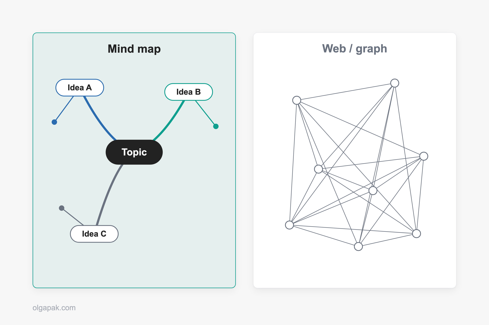
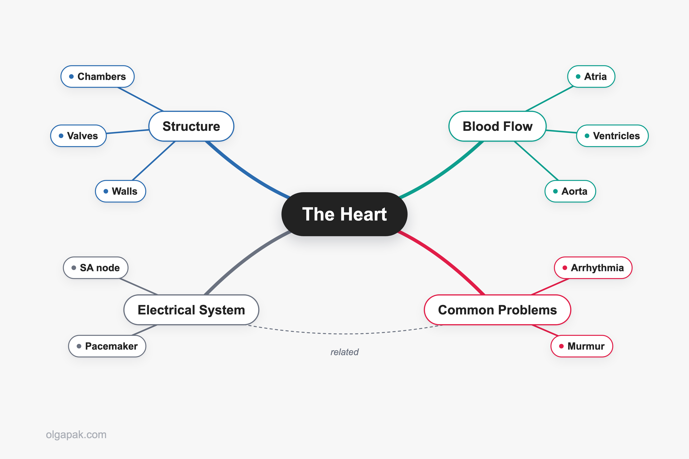
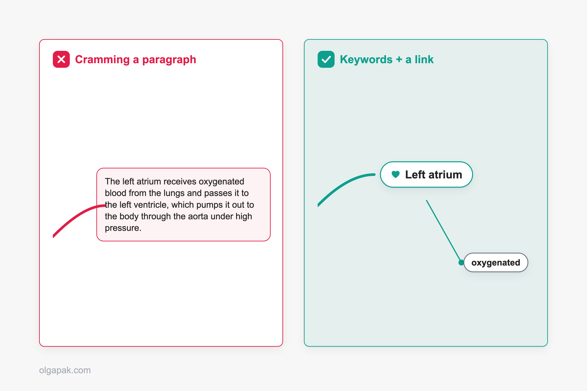

For years I believed good notes were supposed to look a certain way: neat, linear, color-coded pages that could pass for a study-blogger's Pinterest board. Then I'd try to recall any of it and come up blank. The mind mapping note-taking method starts from the opposite idea, that your brain doesn't actually think in straight lines. It jumps to whatever sits nearby on your mental map.

I relearned how to study as an adult, back when I left a decade in aviation PR to go back for a Master's, and I tested the popular note-taking methods on real coursework to see which ones held up. Mind mapping helped in some places and fell flat in others, and I'll be honest about both.

Mapping is one of four methods I keep coming back to, so if you want to compare the main [note-taking methods](/note-taking-methods) against each other, I've laid that out separately.

This guide covers what the method really is, why it works, when it beats linear notes (and when to skip it), a step-by-step way to build one, paper versus digital, plus the tips and beginner mistakes that decide whether your first map actually helps.

## What Is the Mind Mapping Note-Taking Method?

A mind map is a visual note that starts from one central topic and branches outward, with each branch a short keyword instead of a full sentence. The structure mirrors the way ideas connect in your head, which is sometimes called radiant thinking: everything radiates out from one center.

You might already know it as a concept map or a spider diagram. Same idea, different name.

Here's the part beginners get wrong. A mind map is a hierarchy, not a web. One central topic sits in the middle, and you work outward, adding the points that flow from and connect to it. Each branch can grow child branches, but the flow runs parent to child, not everything-to-everything.

As one person on r/PKMS put it, they wanted "a mind map like structure instead of a web of interconnections," not the tangled graph view you get in an app like Obsidian where every note links to every other note. If linear notes run straight down the page, [the outline method](/outlining-note-taking-method) is a tidy nested list, and [the charting method](/charting-method-note-taking) is a grid of labeled columns, a mind map is the opposite shape: it grows outward from the middle.

## Why Mind Mapping Works for Notes

The point of a mind map isn't to capture every word. It's to see how ideas relate.

One student on r/NoteTaking described switching to a map for their atomic structure notes and said that "seeing everything visually connected made it much easier to understand how the topics relate instead of just memorizing isolated points." It felt, in their words, "more like building a system than just taking notes." That matches my experience exactly. The map makes the relationships between ideas visible, which is the part linear notes hide.

So why does laying ideas out in space help you remember them? Part of it is that you encode each idea more than once: its position on the page, its color, the little picture you doodle beside it. Researchers even have a name for a related effect, the [picture superiority effect, where pictures are remembered better than words](https://pmc.ncbi.nlm.nih.gov/articles/PMC3483366/). A branch you drew and placed yourself is far easier to find again than the ninth line on page four of your notebook.

## When to Use Mind Mapping (and When to Skip It)

Mind maps are not a universal upgrade. They shine for some jobs and get in the way for others.

| Reach for a mind map when | Skip it, use linear notes when |
|---|---|
| You want the big-picture overview of a topic | You need fast math or derivations captured live |
| You're connecting concepts across a chapter | You need verbatim, word-for-word capture |
| You're brainstorming and don't know the shape yet | The material is dense, sequential detail |
| You're revising and want to see structure | You're transcribing a fast-moving lecture |

The short version: maps are strongest for overviews and seeing connections. For detailed, step-by-step material, a linear structure usually wins.

Real students say the same thing. One person on r/study who had tried a few methods wrote that "none of them really work for me during lectures, especially when there's a lot of math and derivations moving fast on the board." Mapping is not what you want when the board is moving faster than your pen.

And the honest counterpoint, from the top comment under a popular mind-mapping post on r/IBO: "thats just notes but with extra steps." Fair. A map is not a substitute for active recall or past papers. It won't quiz you. What it does well is show you the shape of a topic so you know what to drill later. Understanding structure and testing yourself are two different jobs, and mapping only does the first.

When you genuinely need to capture detail, a method like [focused note-taking](/focused-note-taking-how-to-guide) fits the job better. And if you're still deciding, it helps to compare the main [note-taking methods](/note-taking-methods) and match each one to the situation in front of you.

## How to Make a Mind Map for Notes, Step by Step

Let me build one so this isn't abstract. Say you're mapping a biology chapter on the human heart for revision. Here's the process I follow, which borrows from the rules [Tony Buzan popularized](https://www.boisestate.edu/online/2021/12/16/what-is-mind-mapping/) decades ago: a central image, branches that run thick to thin, and one keyword per line.

### Step 1: Start With One Central Topic

Put your subject in the middle of a blank page and circle it. "The Heart." A word or a small drawing both work. This is the root everything else hangs off, so give it room to breathe.

### Step 2: Add Main Branches for the Big Ideas

Draw three to seven thick branches out from the center, one for each major theme. For the heart, that might be Structure, Blood Flow, Electrical System, and Common Problems. These are your chapter's headline ideas, and keeping the count small keeps the map readable.

### Step 3: Break Each Branch Into Sub-Branches

Now hang the details off their parent branch as thinner lines. Under Structure: chambers, valves, walls. Keep going two or three levels deep until each idea has a home. The lines thinning as you go outward is what keeps the hierarchy readable at a glance.

### Step 4: Use Keywords, Not Sentences

This is the rule that makes or breaks a map: one to five words per branch, never a paragraph. "Left atrium," not "the left atrium receives oxygenated blood from the lungs." Short labels force you to understand the idea instead of transcribing it. Get this wrong and you've drawn a messy essay. Ask me how I know. It's the number-one mistake I'll come back to at the end.

### Step 5: Add Color, Images, and Connections

Give each main branch its own color so your eye can track a theme across the page. Add small icons where a picture beats a word. Then draw cross-links between branches that relate, say a line from Electrical System over to a heartbeat symbol under Common Problems. Those cross-links are where a map earns its keep.

### Step 6: Review and Rebuild for Revision

Here's the step most people skip. Come back to the map and quiz yourself from it, or redraw it from memory. Maps are strongest when you build them after class, from your messy notes, as a revision tool, which is exactly how the students I read describe using them. The rebuild is the studying.

## Paper vs. Digital Mind Maps

People always ask which is better, paper or an app. Honestly, I use both, for different reasons. The same question comes up for notes in general, and I worked through [whether to go digital or stay on paper](/digital-vs-paper-notes) separately.

When I'm thinking something through for the first time, I reach for paper. A big unlined sheet or a landscape page gives you room to sprawl, and nothing interrupts the flow while you're drawing. A [roomy unlined notebook](/best-notebooks-for-note-taking) helps here more than any app does.

When I want a map I'll keep coming back to, digital wins:

- You can drag branches around and recolor without redrawing the whole thing.
- You can share it or drop it into a study group.
- You can link a node straight back to the source PDF or lecture slide.

That last one matters for revision maps you return to all term. My rule is simple: paper for thinking, an app for keeping. Pick by the task, not by which one feels more "proper."

## Tips for Better Mind Map Notes

Small habits are what separate a map that helps from a map that just looks busy. Here's what I'd tell my past self:

- Keywords over sentences, always. One to five words per branch.
- Use color and images to carry meaning, not as decoration.
- Build one branch at a time so you don't overwhelm the page.
- Leave whitespace. Maps grow, and a cramped map is hard to add to.
- Build the map after class, from your messy notes, as revision.
- Condense long source material first so your branches stay short.

That last one trips people up. A dense 20-page chapter is hard to map because you don't yet know which ideas deserve to be main branches. This is where I lean on my free [Text Summarizer](https://olgapak.com/ai-tools) to boil a long source down to its key points first, so I'm mapping the skeleton instead of the whole body.

And if you want your maps to look good without tipping into over-decoration, the same color-and-icon habits carry straight over to [how to make aesthetic notes](/how-to-make-aesthetic-notes-complete-step-by-step-guide) that still function as study tools.

## Common Mind Mapping Mistakes to Avoid

Most first maps fail for the same handful of reasons. I made most of these myself before anything clicked.

The big one is cramming paragraphs into branches. As one IB student put it on r/IBO, "your mind maps should NOT have big slabs of text… having paragraphs in your mind maps defeats the whole purpose of doing them." A branch is a keyword and a connection, not a sentence.

The rest show up just as often:

- Trying to map live during a fast lecture. If the material moves quickly, capture rough notes or record it, then build the map afterward.
- Over-designing it. A beautiful map you spent an hour coloring in is not the same as studying. Make it useful first, pretty second.
- Never reviewing it. A map you draw once and never revisit is just a drawing.
- Forcing a map onto sequential content. Some material is genuinely a list or a step-by-step process. Let it stay linear.

## Start Your First Mind Map

You don't need the perfect method or the perfect app to begin. Pick your next topic, put it in the middle of a blank page, and give yourself three branches. That's a mind map.

And if the source is long, condense it before you map it. [Try my free AI tools](https://olgapak.com/ai-tools) to automate the mundane, then map the summary instead of wrestling with the whole chapter.

## FAQ

### What is the mind mapping note-taking method?

It's a visual way of taking notes where you start from one central topic in the middle of the page and branch outward into related ideas, using a short keyword on each branch instead of full sentences. The layout shows how ideas connect rather than listing them in a straight line, which makes it easier to see the structure of a whole topic at a glance.

### Is mind mapping better than linear note-taking?

It depends on the job. Mind mapping is better when you want an overview, when you're connecting concepts across a topic, or when you're revising and want to see how everything fits together. Linear notes are better for dense, sequential detail and for fast, word-for-word capture, like a lecture full of math moving quickly on the board. Many students use both, mapping for the big picture and linear notes for the fine detail.

### How do you make a mind map for studying?

Start with your topic in the center of the page. Add three to seven main branches for the big ideas, then break each one into thinner sub-branches for the details. Keep every label to a few keywords, add color and small images to help recall, and draw cross-links between branches that relate. Maps work best when you build them after class from your messy notes, then quiz yourself from the finished map.

### Can you make a mind map during a lecture?

It's hard to map live when the material moves fast, because mapping asks you to organize ideas at the same time you're trying to keep up. A better approach is to capture rough notes or record the lecture, then build the map afterward when you can pause, rewind, and see the whole topic. That's how a lot of successful students actually use the method.

### What are the disadvantages of mind mapping?

Mind mapping is less suited to detailed, linear, or heavily numeric information, and it can get messy or time-consuming if you're not disciplined about keeping branches short. It's also easy to spend so long making a map look good that you mistake decorating for studying. And on its own a map won't test you, so pair it with active recall when you actually need to memorize.
