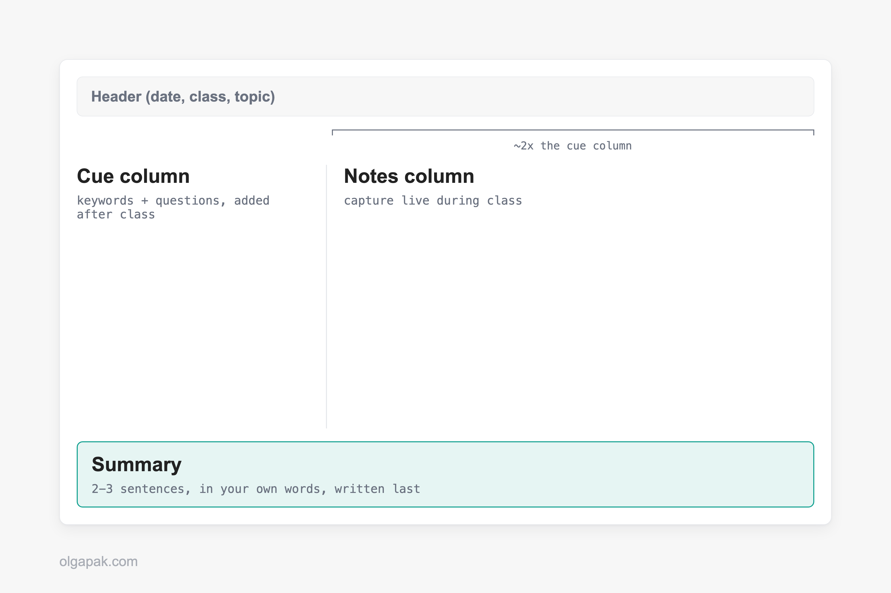
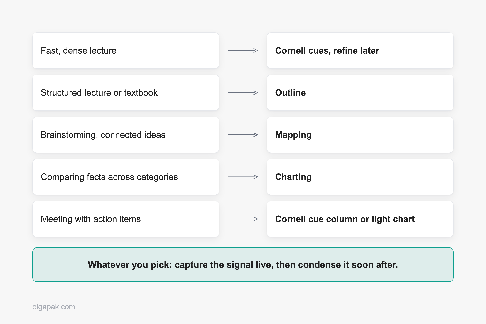

For years, my idea of taking notes was writing down almost every word and remembering almost none of it. Sound familiar? One Reddit user summed up the trap perfectly: passive note-taking creates the illusion of learning, you feel productive but nothing sticks. The fix was not trying harder. It was choosing the right note-taking method for the situation in front of me.

When I went back for my Master's after a decade in aviation PR, I had to relearn how to study from scratch, so I tested these methods on real lectures and readings instead of just reading about them.

That is when it clicked that [taking notes that actually stick](/focused-note-taking-how-to-guide) has less to do with neat handwriting and more to do with matching your approach to what you are actually doing.

This guide puts the four main note-taking methods, Cornell, Outline, Mapping, and Charting, side by side, shows what each is genuinely good and bad at, and gives you a simple way to pick the one that fits your next lecture, meeting, or reading.

## The 4 Note-Taking Methods at a Glance

Before we go deep on any single one, here is the whole landscape on one screen. Most guides make you scroll through method after method to compare them. I would rather hand you the table I wish I had when I started.

| Method | How it's laid out | Best for | Effort | Built-in review |
|---|---|---|---|---|
| Cornell | Page split into a cue column, a notes area, and a summary strip | Lectures, review, self-testing | Medium | Yes |
| Outline | Indented bullets, main points with sub-points underneath | Structured, sequential content | Low | No |
| Mapping | A central topic with branches fanning out to related ideas | Showing connections, brainstorming, the big picture | Medium | No |
| Charting | Pre-drawn columns you fill in row by row | Comparing facts across categories | Higher setup | Partial |

The last two columns are the ones I wish someone had shown me sooner: how much upfront effort a method costs, and whether it makes you review what you wrote. Those two things quietly decide whether a method survives a busy week.

Notice that no single method wins every row. That is the whole point. As one note-taker on X put it, the question is not which method is better, but what is the proper method for the task at hand. Think of these four as a toolbox, not four religions competing for your loyalty. You reach for the tool that fits the job.

## The Cornell Method

The Cornell Method splits your page into three zones: a narrow cue column on the left, a wider notes area on the right, and a summary strip along the bottom. You take notes in the main area during class, jot questions or keywords in the cue column afterward, and write a few summary lines at the bottom to lock in the gist.

What makes Cornell special is that review is baked into the layout. Cover the notes area, read a cue, and try to recall the answer. You have a built-in self-test without making flashcards. It gives you a systematic way to condense and organize notes without laborious recopying, which is exactly why it works so well for lectures and concept-heavy subjects you need to revisit. One teacher I came across online went as far as swapping laptops for Cornell notes in class, and found that reviews and repetition became part of the lesson itself rather than a separate chore.

It is not magic, though. Cornell struggles when a session is very fast and packed with terminology or statistics, because you are trying to structure the page at the same moment you are trying to keep up. Plenty of people also carry a grudge from being forced to use it in school, and forced tools rarely feel like your own. Fit is genuinely individual, too. As one student admitted on Reddit, their teacher's Cornell notes did nothing for them personally but worked beautifully for the rest of the class. Treat it as a starting point to test, not a verdict.

The method comes from Walter Pauk, a professor who developed [the Cornell system at Cornell's own Learning Strategies Center](https://lsc.cornell.edu/notes.html). If you want the full walkthrough with templates, I wrote a dedicated guide on [the Cornell note-taking method](/cornell-note-taking-method).

## The Outline Method

The Outline Method is the one you probably already do without naming it: main points on the left, sub-points indented underneath, going a level deeper each time the material does. It mirrors the structure of whatever you are listening to or reading.

That makes it the low-effort champion for anything already organized. Say you are sitting through a lecture on the causes of a war: a main heading for each cause, indented bullets for the evidence under it. As long as the speaker moves cause by cause, your page stays clean and you barely have to think about layout. A textbook chapter with clear headings or a training doc that moves step by step works the same way, because the structuring has already been done for you. You just follow the shape.

So when does it fall apart? The moment the material stops being linear. If a lecturer jumps around, circles back, and connects ideas out of order, an outline turns into a mess of orphaned bullets you cannot slot anywhere. It also does little to help you see relationships between far-apart points, since everything is stacked in a single vertical column.

If Outline sounds like your default, it is worth doing it deliberately rather than by accident. Here is [how the outline method works in detail](/outlining-note-taking-method), including how to keep your indent levels from sprawling.

## The Mapping (Mind Mapping) Method

A mind map is a visual, non-linear way of taking notes: you put the main topic in the center of the page and draw branches out to related ideas, then sub-branches off those. Instead of a top-to-bottom list, you get a web that shows how everything connects.

> **Image pending:** Hand-drawn mind map with a central topic and four branches fanning to sub-ideas (Type: ai-prompt). Create this asset per action-items, then replace this line with the image embed.

This is the method to reach for when relationships matter more than sequence. Brainstorming a project, mapping how the causes of an event feed into each other, or getting the big picture of a messy topic all suit mapping well. There is a nice side benefit, too: the act of rearranging linear notes into a non-linear map helps commit those ideas to long-term memory, because you have to actually think about how the pieces fit rather than just copy them down.

Mapping has a clear weak spot. It is poor for dense factual detail delivered fast, like a lecture rattling off dates, formulas, or definitions. There is no clean place to park a wall of facts on a branching diagram, and drawing while listening at speed is hard. Use it to think, not to transcribe.

## The Charting Method

The Charting Method is a table you build before the information arrives. You draw columns for the categories you expect, then fill in rows across them as you go. Think of comparing three economic theories across the same four attributes, or five battles across date, cause, outcome, and significance.

> **Image pending:** Filled charting-method table comparing a few items across four labeled columns (Type: ai-prompt). Create this asset per action-items, then replace this line with the image embed.

Charting shines exactly where the others strain: comparing facts across categories, especially when the content is both fact-heavy and relationship-heavy and delivered fast. If you know a test will focus on both the facts and how they relate, and the material is dense and quick, a pre-drawn chart lets you drop each detail into the right cell without pausing to structure anything. The structure is already there.

The catch is that you have to know your categories in advance. Charting is a poor fit for unstructured or discussion-style content, where the shape of the material is not clear until it is over. Build the wrong columns and you are stuck redrawing mid-lecture. It also takes the most upfront setup of the four, since you are laying out the grid before class even starts.

## Which Method Fits Which Situation

Here is the part most guides skip. Instead of asking what kind of learner you are, ask what you are actually doing. The situation picks the method far more reliably than any personality label.

- **Fast, dense lecture you can barely keep up with:** capture minimal signals (Cornell cues, or tiny flags like "explain this later"), then refine at home.
- **A well-organized lecture or a textbook chapter:** Outline, and let the material's structure do the work.
- **Ideas with lots of connections, brainstorming, or a big messy topic:** Mapping.
- **Comparing facts across categories, delivered fast:** Charting.
- **Meetings with action items:** a Cornell-style cue column or a light chart, but honestly the "after" matters most here, so leave room to pull out the decisions and to-dos.
- **STEM versus conceptual material:** concept-heavy subjects lean Cornell or Outline, while fact- and relationship-dense material (think a bio unit full of comparisons) leans Charting or Mapping.

Whatever you pick, the real lever is the same one Reddit keeps landing on: capture, then refine. Do not try to write clean, permanent notes live. Get the signal down in the moment, then condense and organize it soon after, when your brain is not also trying to listen. Many people work in exactly two stages for this reason, and it beats transcribing every word.

There is a more radical version of this worth knowing about. One student wrote about giving up live notes entirely, jotting only tiny signals about what to revisit ("good example, rewrite later," "did not fully get this definition"), then rebuilding real notes calmly at home. It sounds extreme. It is really just capture-then-refine pushed to its limit, and it frees you to actually listen instead of running a transcription stress test. A light Cornell cue column is the gentler middle path to the same idea. And if most of your notes come from reading rather than lectures, it is worth knowing SQ3R (survey, question, read, retrieve, review), a reading routine that layers neatly on top of any of these four.

Now, the question everyone asks: handwriting or typing? Choose by task, not by "learning style," which researchers have debunked as a basis for these decisions. Handwriting tends to help with conceptual understanding. One study found that [handwriting engages memory-and-learning brain regions more than typing](https://www.frontiersin.org/journals/psychology/articles/10.3389/fpsyg.2020.01810/full), and in a well-known 2014 experiment, [students who wrote notes by hand understood concepts better than those who typed them](https://pubmed.ncbi.nlm.nih.gov/24760141/). Typing wins on speed and searchability, and for purely factual recall it can work too: transcribing a lecture nearly word for word can help with short-answer questions, but only if you review those notes within 24 hours. So type for fast, factual, searchable material, and handwrite for anything you need to truly understand.

## The Step Most People Skip: What to Do With Your Notes After

You can pick the perfect method and still learn nothing. The method only pays off if you go back to your notes and do something with them: condense them, quiz yourself, resurface them before they go cold. That "after" work is where the learning actually happens.

This is the real bottleneck, and people feel it. As one Reddit user put it, the real challenge is not capturing notes, it is making them resurface when they matter. Notebooks pile up, action items get buried, and good ideas quietly disappear. So the habit that beats any single method is simple: after each session, force yourself to condense the notes into a few bullet points. If you cannot, you have found exactly what you did not understand.

There is a trap on the other side, too. Plenty of people build elaborate systems and then spend more energy maintaining the app than taking the notes. As one Redditor admitted, the upkeep of a complex setup ended up costing more time than the note-taking itself. For busy people, low-effort and consistent beats elaborate and abandoned every single time.

When you have got pages of notes or a long reading to distill, a free tool like the [Text Summarizer](/ai-tools/ai-text-summarizer) can speed up that condense step, turning a wall of text into a short, scannable version you can actually review. Match the tool to the task, the same way you match the method.

And do not overthink the container. Paper or an app both work. If you love the feel of a physical notebook, a good one is worth it, and I will share my favorites in a dedicated round-up soon.

## Pick One and Try It This Week

You do not need the perfect system. You need to pick the method that fits your next lecture, meeting, or reading, and then actually do the condensing afterward. That is the whole game.

Once your notes are down, let a tool handle the tedious part. [Try my free AI tools](/ai-tools), starting with the Text Summarizer, to condense your readings and notes so what you learned actually sticks. Automate the mundane, and keep your energy for the learning itself.

## FAQ

### What is the best note-taking method?

There is no single best one, and any guide that crowns a winner is oversimplifying. The right method depends on the content and the task. Reach for Cornell in lectures you need to review, Outline for well-structured content, Mapping when you are connecting ideas or brainstorming, and Charting when you are comparing facts across categories. Pick by situation, not by personality.

### Which note-taking method is best for studying or exams?

Cornell is the strongest default for exam studying because its cue column and summary strip build review right into the page, so you can self-quiz without making separate flashcards. That said, the method matters less than the habit around it. What moves your grades is capturing the signal live, condensing your notes soon after, and quizzing yourself before the material goes cold.

### Is handwriting or typing notes better?

It depends on the task. Handwriting tends to help with conceptual understanding and retention, which is why it wins for material you need to truly grasp. Typing wins on speed and searchability and is fine for fast, factual content you plan to review quickly. Choose by what you are doing, not by "learning style," which is not a reliable basis for the decision.

### What is the Cornell note-taking method?

Cornell splits your page into three parts: a cue column on the left for questions and keywords, a larger notes area on the right for the main content, and a summary strip along the bottom to capture the gist in your own words. Cover the notes, read a cue, and recall the answer to turn your page into a built-in self-test. My dedicated Cornell guide walks through it with templates.

### Can I combine note-taking methods?

Yes, and most people do. Methods are tools, not rules. It is completely normal to outline a lecture live, then add Cornell-style cues and a summary afterward, or to sketch a quick map to see how a charted comparison connects. Use whichever combination fits the material in front of you.
