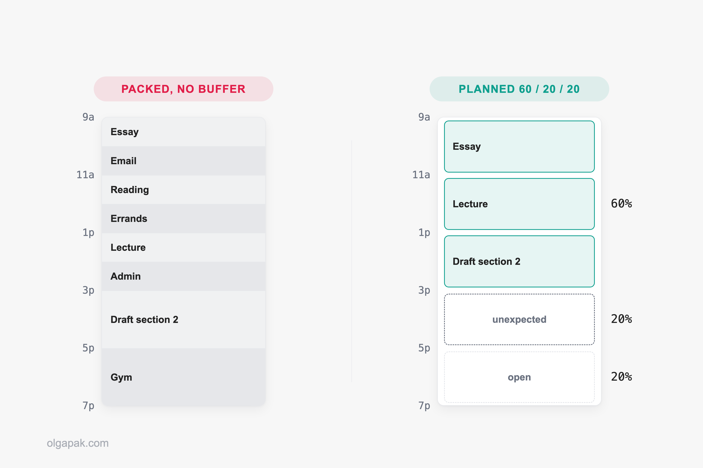
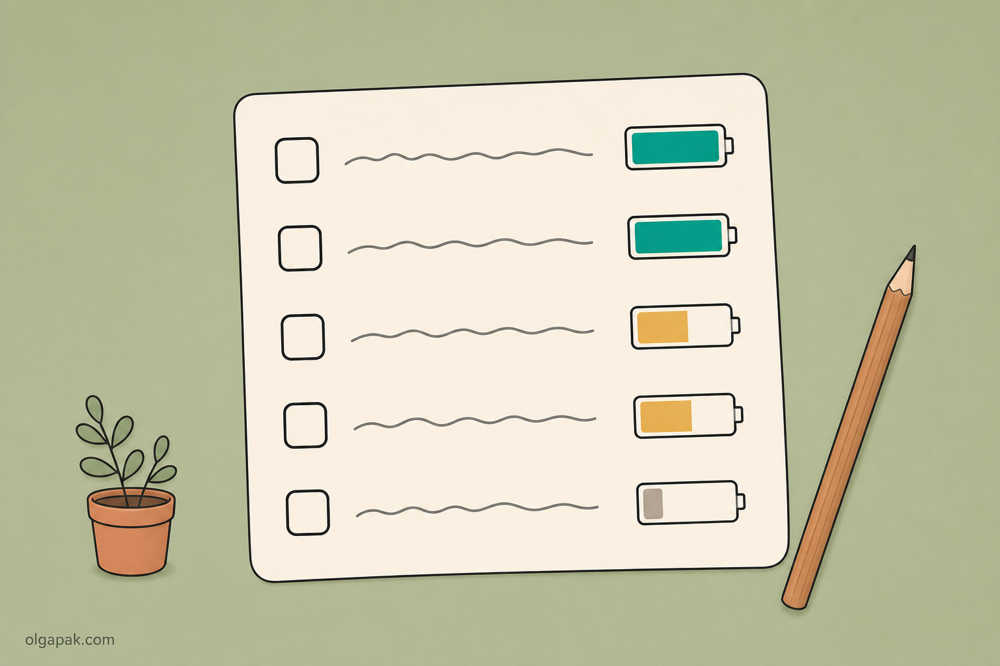

You block out your whole day, feel briefly invincible, and by 11am one long phone call has flattened the entire thing. That is usually the moment people decide time blocking doesn't work for them.

I started blocking out my days while juggling a Master's with a side project, mostly because my to-do list had quietly turned into a wish list. The version that finally stuck looks nothing like the tidy color-coded grids you see online.

I've written before about [planning tips that hold up](/planning-tips-to-maximize-productivity), and this is the daily layer of the same idea: not a new system, just a calendar you can actually keep.

This guide covers what the method actually is, how it differs from the three techniques people constantly confuse it with, how to block out tomorrow step by step, how much of the day to leave deliberately empty, and what to do when it collapses anyway.

## What is time blocking (and why does it work)?

Time blocking means giving each chunk of your calendar a job before the day starts. Instead of working from an open-ended list and picking whatever shouts loudest, you decide on Tuesday evening that Wednesday 9:00 to 10:30 belongs to the essay, and 4:00 to 4:30 belongs to email.

Why does swapping a list for a calendar change anything? Because a list has no edges. There is a name for what happens next: Parkinson's Law, the old observation that ["work expands so as to fill the time available for its completion"](https://en.wikipedia.org/wiki/Parkinson%27s_law).

In plainer words, work stretches to fill whatever time you hand it. I learned that the expensive way, by giving myself an entire Sunday for one essay and then watching it take an entire Sunday. A block hands the work a wall to stop at.

A block also quietly forces you to do one thing at a time, which matters more than it sounds. In the research that coined the term "supertaskers," [only about 2.5% of people multitask effectively](https://doi.org/10.3758/PBR.17.4.479). Almost nobody genuinely does two demanding things at once. The rest of us switch fast and call it multitasking.

None of this is new, and it isn't a founder trick. Benjamin Franklin [planned the activities he would undertake each hour of the day](https://en.wikipedia.org/wiki/Timeblocking), and the modern popularizer is Cal Newport, the computer science professor who wrote *Deep Work* (his phrase for long, undistracted stretches on cognitively demanding tasks).

Now the honest part, because most guides skip it. Blocking decides *when* you work on something. It does not:

- decide your priorities for you
- create hours that don't exist in your week
- make you want to do the task

That first one does the most damage. Put the wrong three things on the calendar and you'll do the wrong three things beautifully, which is why [staying focused on what matters](/how-to-stay-focused-on-goals) is a separate job that comes first.

## Time blocking vs timeboxing vs task batching vs day theming

These four terms get swapped around as though they mean the same thing. They don't, and mixing them up is a surprisingly common reason people conclude the method failed them.

| Method | What you actually do | Sounds like |
|---|---|---|
| Time blocking | Reserve a chunk of calendar for a kind of work | "9:00 to 11:00 is thesis time" |
| Timeboxing | Give a task a hard deadline and stop when it's up | "45 minutes on the slides, then I stop" |
| Task batching | Group similar small tasks into one block | "All my email at 4:00" |
| Day theming | Give a whole day a single focus | "Mondays are admin days" |

The line that matters most is the first two. Blocking reserves the container, while timeboxing puts a hard stop inside it: when the time is up you stop, finished or not. It's a full method in its own right, so rather than half-explain it here, I've written up [what timeboxing actually is](/what-is-timeboxing) separately.

Task batching is about grouping. Instead of opening your inbox nine times, you pile the small stuff into one afternoon block and pay the start-up cost once. Day theming zooms out further: the whole day gets one focus, which is lovely when your work already clumps that way (classes on two days, writing on the others) and useless when it doesn't.

Which one are you actually looking for?

If your problem is that the day disappears, start with blocking. If your problem is that one task swallows an entire afternoon, you want a hard stop on the task itself. You can also run all of them at once, and most people eventually do. A Thursday themed for writing, holding a 9:00 to 11:00 block for the draft and a batched admin block at 4:00, is three of these techniques stacked in one day.

## How to time block your day, step by step

Here's the routine, in the order I run it. Once it's a habit it takes about five minutes an evening, and the first few attempts will be wrong in ways you only find out by trying.

### Start from your week, not your day

Open the week before you open tomorrow. The things that can't move go down first: classes, shifts, meetings, the commute, the standing call you never remember until it rings. Everything flexible fits around those, not the other way round.

If you don't have a weekly routine yet, [plan your week first](/how-to-plan-your-week) and treat daily blocks as the layer underneath.

### Block the big things, not every little thing

The fastest way to ruin this is to schedule your entire life in fifteen-minute slices. u/SalkMe put it well in [r/ProductivityApps](https://www.reddit.com/r/ProductivityApps/comments/1tqw7h1/best_apps_for_time_blocking/): "Don't time-block every tiny task. Just block deep work, studying, errands, workouts, and fixed commitments. If your calendar becomes a perfect fantasy schedule, you'll stop trusting it."

That last clause is the whole risk. A calendar you've stopped trusting is just decoration. Small tasks belong on a list you pull from during an admin block, not on the grid.

### Decide how much of the day you'll actually plan

This is the step almost everyone skips, and the one that decides whether the rest works.

How much of the day do you leave alone?

Three concrete answers, from three very different places:

- **Leave real blank space.** Stanford's Center for Teaching and Learning tells students to [aim for at least 15 hours of entirely blank space](https://ctl.stanford.edu/weekly-planning-time-blocking-method) across the week. That's institutional advice for building a weekly calendar, not a research finding, but it's the most concrete buffer number I found anywhere.
- **Try a 60/20/20 split.** u/NectarineActive5664, in [r/productivity](https://www.reddit.com/r/productivity/comments/1pmknhf/anyone_else_struggling_with_time_blocking_what/): "Try planning 60%, keep 20% for unexpected situations and 20% for spontaneous and social activities."
- **Double every estimate.** u/AiotexOfficial, writing in [r/ADHD_Programmers](https://www.reddit.com/r/ADHD_Programmers/comments/1q7byqa/how_i_made_time_blocking_finally_work_for_my_brain/) about making the method survive real life, uses windows instead of blocks, where "each window is about twice the estimated task time. That extra space gives me room for interruptions without feeling like I've [failed]."

Pick one and start there. The doubling rule is the one I'd hand a beginner, because it turns a bad estimate into an ordinary Tuesday instead of proof that you're hopeless.

### Name each block for the work, not the wish

"Be productive" is not a block. "Draft section two" is a block. The test is whether you'd know, at the end of it, that you'd done the thing.

Sizing follows the same honesty. Sixty to ninety minutes is what works for me before attention starts sagging, and admin blocks want to be short, because they expand to fill anything you give them. See Parkinson's Law, above.

### The tools: does the app actually matter?

In that same r/ProductivityApps thread, u/SalkMe argues the app matters less than keeping the system simple: a plain Apple or Google Calendar for the blocks, plus a separate lightweight list for the backlog. Worth saying plainly, that's one commenter's view rather than a settled verdict. Another reply in the thread, u/ihateredditmor, disagrees outright and makes a real case that dedicated scheduling apps add value a bare calendar can't.

So treat "just use your calendar" as a reasonable starting default, not a rule. Whatever you open, Cal Newport [blocks his next day in a short planning session each evening](https://www.calnewport.com/blog/2013/12/21/deep-habits-the-importance-of-planning-every-minute-of-your-work-day/), and doing it the night before beats doing it at 9am while the day is already shouting at you.

## Why your time blocks fall apart by 11am (and how to recover)

The plan rarely dies of weak discipline. It dies because you built an over-packed calendar with zero buffer between blocks: a day designed for a version of you with no interruptions, no bad night's sleep, and no colleagues. This is the timeboxing failure mode leaking into a time-blocked calendar.

u/theodetteapp described it best in [r/productivity](https://www.reddit.com/r/productivity/comments/1pmknhf/anyone_else_struggling_with_time_blocking_what/): "Turns out, my life didn't get the memo... For the rest of us: low expectations, high flexibility." That isn't a reason to quit. It's a reason to plan less of the day.

Expect the calibration to take a while, too. As @mattragland [put it on X](https://x.com/mattragland/status/1703027584647229512): "I promise the first week is going to feel a little messy, because if you've never done this before it's easy to under or overestimate the time it takes to do something."

It's 11:03 and the block is gone. What now?

A blown block is not a blown day. The question to ask first is narrow: can what's left of today absorb the overrun, or is the day now shorter than the work still sitting in it?

- **If it can absorb it, slide.** Push the remaining blocks back in order and accept that the last thing falls off the end. That's a decision, not a collapse, and the thing that fell off still has somewhere to go, because tomorrow isn't full yet.
- **If it can't, drop your lowest-value block whole.** Compressing five blocks into four hours means five things done badly. Killing one means four done properly.

Either way, finish by writing down what the derailed task actually took. Week one isn't performance, it's data collection, and those numbers are what make next week's calendar fit. The doubling rule from the step above is the same fix applied in advance.

One more thing eats blocks, and it isn't a phone call. It's the small screen next to your keyboard, so put it in another room before the block starts, because in a fair fight [your phone will win](/how-to-stop-doomscrolling).

There's a second, quieter reason people stop, and it has nothing to do with plans breaking. The ritual gets dull. As u/Impossible-Skirt6023 wrote in [r/productivity](https://www.reddit.com/r/productivity/comments/1uhixbj/how_do_i_mantain_time_blocking/): "I think it's REALLY boring to plan the day using Google Calendar and I'd have to do it against my will." The fix isn't more discipline. It's a smaller ritual: five minutes, same time every evening, three blocks, done.

## Who time blocking doesn't suit (and what to do instead)

Some days genuinely cannot be blocked, and pretending otherwise is how guides lose people. If your work is face-to-face or physical and measured in seconds (a teller at a counter, someone on a production line, a nurse on a ward), there is no chunk to reserve, while a colleague doing analysis in the same organization can block their whole week.

Two groups in particular find the standard version doesn't fit:

- People in reactive, interrupt-driven roles, where the day is built almost entirely out of other people's requests.
- People whose available energy swings from one day to the next, so a plan made on Monday is fiction by Thursday.

Neither means giving up on structure. Both mean changing what you're structuring. And when blocks keep collapsing for a third reason, the phone rather than the job, the fix sits outside the calendar: [cut the screen time that eats your blocks](/how-to-reduce-screen-time) first.

Cal Newport's counter-move is worth knowing even so: "periods of open-ended reactivity can be blocked off like any other type of obligation." You're not scheduling the interruptions. You're admitting they exist and reserving room for them.

Then there are readers whose available energy simply isn't the same on Monday and Thursday. u/Lost_Count7949, in [r/AuDHDWomen](https://www.reddit.com/r/AuDHDWomen/comments/1t0phfq/timeblocking_is_a_toxic_trap_for_audhd_brains/), scrapped clock times entirely: "I finally scrapped my entire calendar and switched to 'Energy Slices.' I don't assign tasks to a time; I tag them by the amount of mental battery they require (High, Medium, or Low)."

The same thread shows the honest spectrum rather than a single verdict. u/riloky keeps the method in modified form and locates the problem precisely: "I hate allocating a set start/finish time to individual tasks, it always leads to failure for me." Categories, yes. Clock-precision per task, no.

So what replaces the grid?

The alternative people migrate to most is an ordered queue with no times attached. u/Bunnyeatsdesign, in [r/productivity](https://www.reddit.com/r/productivity/comments/1pmknhf/anyone_else_struggling_with_time_blocking_what/): "tasks can take as long as they need to... if a screaming urgent task comes in, it can jump the queue but this doesn't derail the whole day." You keep the order. You give up the clock. For a lot of unpredictable weeks, that trade is worth making.

## Pick tomorrow and block three things

Don't rebuild your life on a Sunday. Pick tomorrow, block three things that genuinely matter, and leave the rest of the day properly empty. If it holds, do it again. If it doesn't, you've just learned what your estimates are worth, which is the actual point of week one.

And if one of those blocks is a pile of reading or admin, [try my free AI tools to automate the mundane](/ai-tools). The Text Summarizer turns a long document into something scannable, which often shrinks the block before it ever reaches your calendar.

## FAQ

### What is time blocking in simple terms?

It means deciding in advance which chunk of your day belongs to which work, then following the calendar instead of an open-ended list. Rather than asking "what should I do now?" thirty times a day, you answer that question once, while you're rested, and spend the day doing the work instead of choosing it.

### How long should a time block be?

In my experience 60 to 90 minutes works for focused work, and admin blocks should be noticeably shorter, since small tasks stretch to fill whatever room you give them. Treat those as starting numbers, not rules: after a week of writing down what things actually took, your own calibration data beats any figure a guide can hand you.

### Is time blocking the same as timeboxing?

No. Time blocking reserves a chunk of your calendar for a kind of work, while timeboxing puts a hard deadline on a specific task and you stop when the time is up, finished or not. The timeboxing half has [its own guide](/what-is-timeboxing) here.

### How much of my day should I leave unplanned?

More than feels comfortable. Stanford's Center for Teaching and Learning advises students to aim for at least 15 hours of entirely blank space across the week, and one reader's rule, from u/NectarineActive5664 on r/productivity, is a 60/20/20 split: plan 60% of your time, keep 20% for the unexpected, and leave 20% for spontaneous and social things.

### What should I do when my time blocks fall apart?

Slide the rest of the day rather than deleting it, and if something has to go, drop your lowest-value block whole instead of squeezing everything into the hours left. Then write down what the derailed task actually took. Week one is calibration, not a test you failed, and those numbers are what make week two fit.
